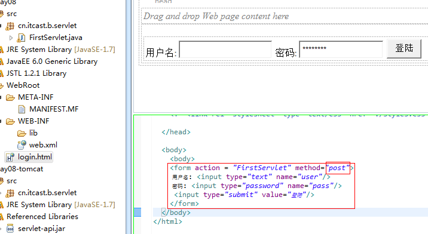
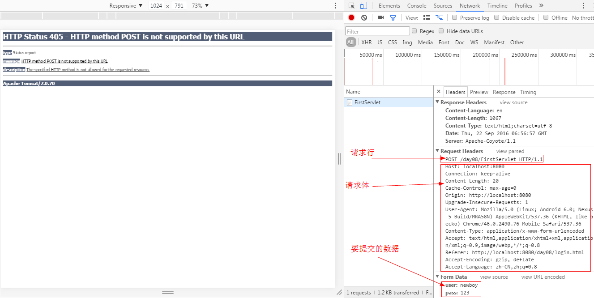

### 请求头示例：
```ruby
GET /day08/FirstServlet HTTP/1.1
Host: localhost:8080
Connection: keep-alive
Cache-Control: max-age=0
Upgrade-Insecure-Requests: 1
User-Agent: Mozilla/5.0 (Linux; Android 6.0; Nexus 5 Build/MRA58N) AppleWebKit/537.36 (KHTML, like Gecko) Chrome/46.0.2490.76 Mobile Safari/537.36
Accept: text/html,application/xhtml+xml,application/xml;q=0.9,image/webp,*/*;q=0.8
Accept-Encoding: gzip, deflate, sdch
Accept-Language: zh-CN,zh;q=0.8
```

### 请求信息（重点）
#### 一、HTTP请求的组成：
##### 1. 请求行：
```ruby
GET /day08/servlet/FirstServlet HTTP/1.1
```
##### 2. 请求头：
```ruby
Host: localhost:8080                                                              访问的主机名
If-Modified-Since:                                                        服务器修改内容的时间  
Connection: keep-alive                                                    连接的状态
Cache-Control: max-age=0                                                            是否使用缓存
Upgrade-Insecure-Requests: 1
User-Agent: Mozilla/5.0 (Windows NT 10.0; WOW64) AppleWebKit/537.36 (KHTML, like Gecko) Chrome/51.0.2704.106 Safari/537.36   浏览器类型
Accept: text/html,application/xhtml+xml,application/xml;q=0.9,image/webp,*/*;q=0.8    服务器允许的数据类型
Accept-Encoding: gzip, deflate, sdch                                        可以使用的压缩格式
Accept-Charset: ISO-8859-1                                                    服务器使用的字符集CharSet
Accept-Language: zh-CN,zh;q=0.8                                            可以使用的语言环境
Referer: http://www.itcast.cn/index.jsp                                      从哪个页面过来的
```
##### 3. 空行：
        在请求头与请求体之间有一个空行
##### 4. 请求体：
        在post方法提交数据的时候会有一个请求体，提交的数据是放在请求体中发送的。
##### 5.示例
###### 编辑网页:

      
###### 浏览器打开:

###### 查看头部信息:
