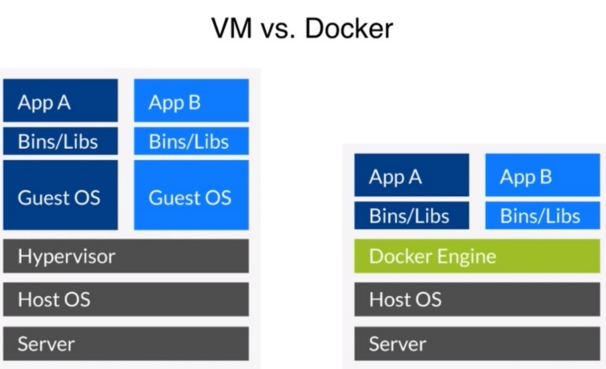
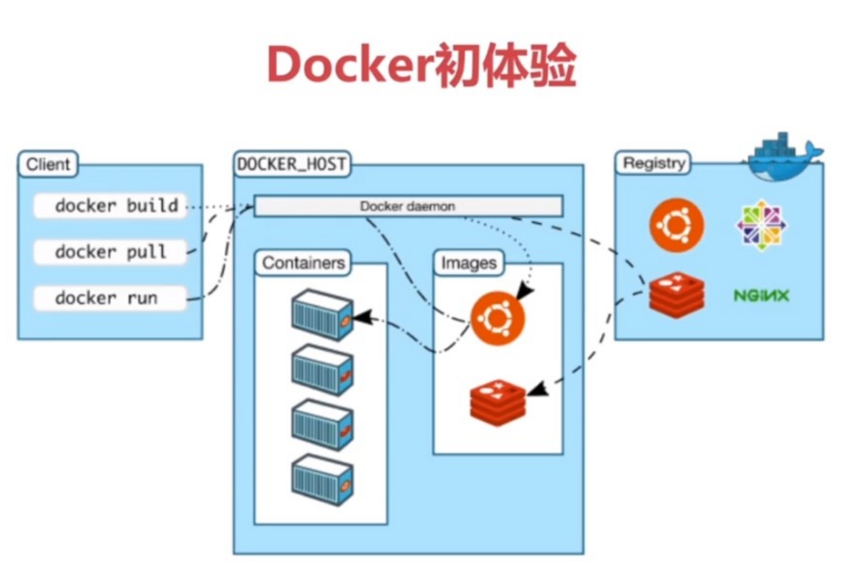
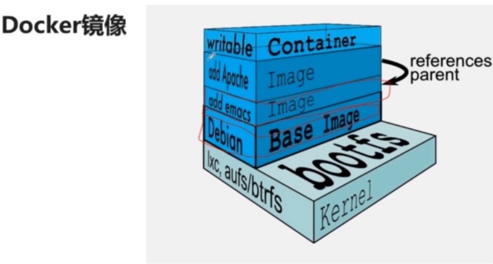

# docker介绍

[TOC]

### 三种操作:

build:构建镜像

ship:运输镜像

run:运行镜像

### 三个概念:

镜像:

容器:运行用

仓库:传输用

### docker的文件系统:镜像

### docker仓库:

<https://hub.docker.com/explore/>

163网易蜂巢:

<https://c.163.com/hub#/m/home/>