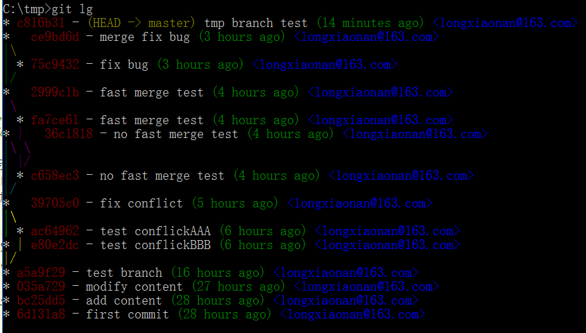

## 自定义git
### 忽略特殊文件/文件夹
在有些时候，我们的Git项目里会有一些特殊的文件，可能是系统自生成的文件，在你每次提交的时候都会提示你有文件改动了，提示你添加这些文件。这样是不是很烦人？因此我们需要忽略这类文件。

我们需要在Git工作区的根目录下创建.gitignore文件，在这之前我们先创建一些需要忽略的文件夹：
```
C:\tmp>mkdir other

C:\tmp>mkdir bad

C:\tmp>mkdir ignore

C:\tmp>type NUL>.DS_Store

C:\tmp>dir
 驱动器 C 中的卷没有标签。
 卷的序列号是 7464-B46A

 C:\tmp 的目录

2019/06/15 周六  16:50    <DIR>          .
2019/06/15 周六  16:50    <DIR>          ..
2019/06/15 周六  16:50                 0 .DS_Store
2019/06/15 周六  16:49    <DIR>          bad
2019/06/15 周六  00:53                13 git.txt
2019/06/15 周六  16:50    <DIR>          ignore
2019/06/15 周六  16:49    <DIR>          other
2019/06/15 周六  13:47               173 readme.txt
               3 个文件            186 字节
               5 个目录 28,082,196,480 可用字节

C:\tmp>
```
>上面非`.txt`结尾的都是需要被忽略的。

我们先使用git status查看一下状态：
```
C:\tmp>git status
On branch master
Untracked files:
  (use "git add <file>..." to include in what will be committed)

        .DS_Store

nothing added to commit but untracked files present (use "git add" to track)

C:\tmp>
```
没自定义忽略的文件/文件夹前，会把所有改动过的文件/文件夹进行提示。

如果你们没看见有文件夹显示，那是因为你的文件夹下没有文件/文件夹，Git自动会忽略空目录。解决方法很简单，只要在文件夹下添加文件就可以了。

现在我们可以创建.gitignore文件了，文件内容如下所示：
```
C:\tmp>type NUL>.gitignore
C:\tmp>echo # remark >>.gitignore
C:\tmp>echo *.DS_Store >>.gitignore
C:\tmp>echo ignore >> .gitignore
C:\tmp>echo other >> .gitignore
C:\tmp>echo bad >> .gitignore
C:\tmp>type .gitignore
# remark
*.DS_Store
ignore
other
bad

C:\tmp>
```
有#号的那一行都是备注，并没有实质作用。

*.忽略后缀名为……的文件

ignore、other、bad为忽略的文件夹
注意，要把.gitignore文件放到版本库里：
```
C:\tmp>git add .gitignore
```
再查看状态
```
C:\tmp>git status
On branch master
Changes to be committed:
  (use "git reset HEAD <file>..." to unstage)

        new file:   .gitignore


C:\tmp>
```

### 自定义别名
我们可以像开发那样，自己定义一个关键字类型。

我们查看状态时，一般都是使用git status，如果你想简化成git st，那么：
```
C:\tmp>git status
On branch master
Changes to be committed:
  (use "git reset HEAD <file>..." to unstage)

        new file:   .gitignore


C:\tmp>git config --global alias.st status

C:\tmp>git st
On branch master
Changes to be committed:
  (use "git reset HEAD <file>..." to unstage)

        new file:   .gitignore


C:\tmp>
```
>--global参数表示全局定义，也就是说定义了之后，在当前电脑下的所有Git仓库都通用。如果不想定义为全局，那么把--global参数去掉即可。

前面我们想要简化git log显示内容时，是否需要输入一大串字符(git log --pretty=oneline --abbrev-commit)？现在我们可以为它创建别名进行简化输入了，并且显示更加强大：
```
git config --global alias.lg "log --color --graph --pretty=format:'%Cred%h%Creset -%C(yellow)%d%Creset %s %Cgreen(%cr) %C(bold blue)<%an>%Creset' --abbrev-commit"
```
代码片段转自：http://blog.csdn.net/n289950578/article/details/24465663
效果如下：

>是不是很惊喜，竟然是彩色显示

在`C:\Users\Administrator`目录下的隐藏文件.gitconfig
```
[user]
	name = longxiaonan@163.com
	email = longxiaonan@163.com
[alias]
	st = status
	lg = log --color --graph --pretty=format:'%Cred%h%Creset -%C(yellow)%d%Creset %s %Cgreen(%cr) %C(bold blue)<%an>%Creset' --abbrev-commit
```
>MAC OS的全局Git配置文件在用户主目录（Macintosh HD ▸ Users ▸ 你的用户名）下的隐藏文件.gitconfig中

当我们想要取消别名时，只需要把对应的别名行删除即可。如果是定义非全局的Git配置文件，那么它在当前项目的根目录下的.git隐藏文件夹下的config文件。
