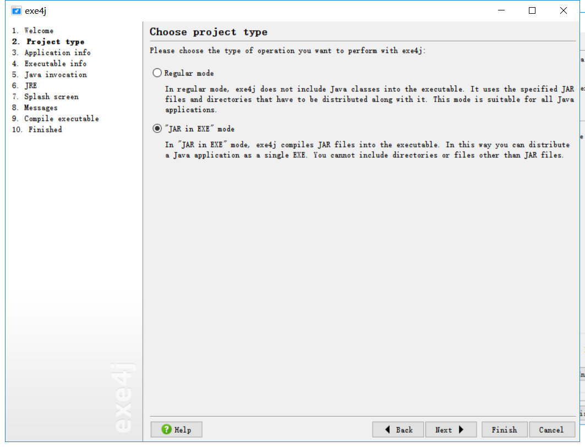
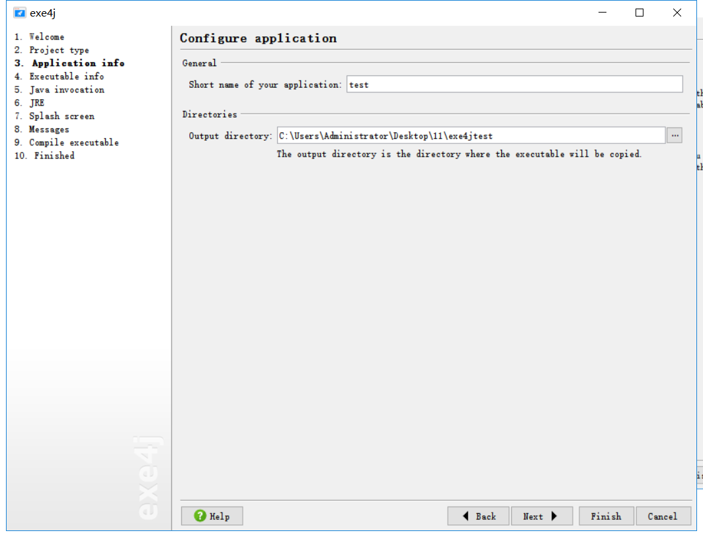
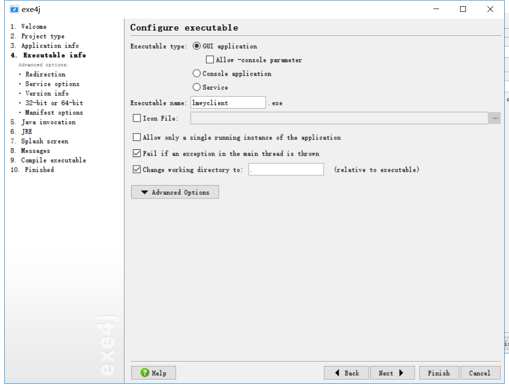
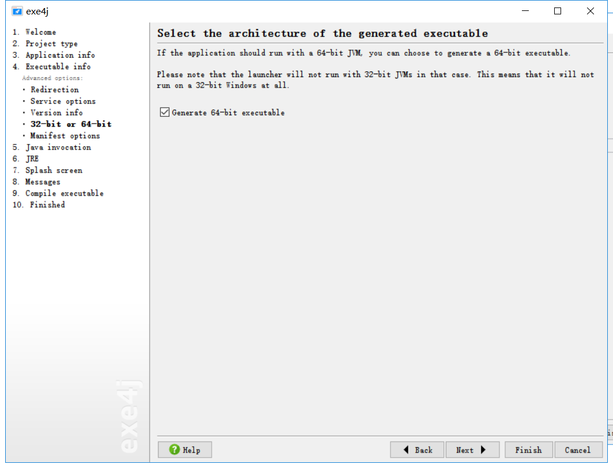
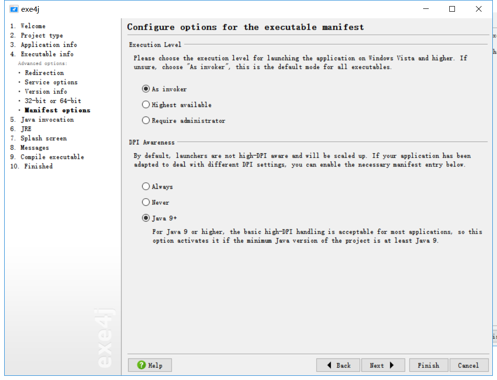
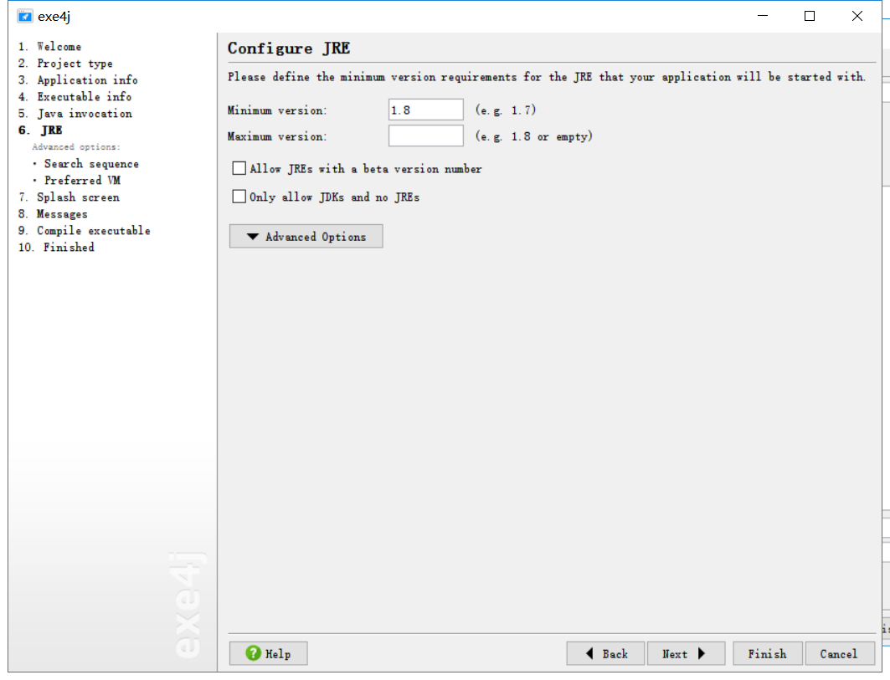
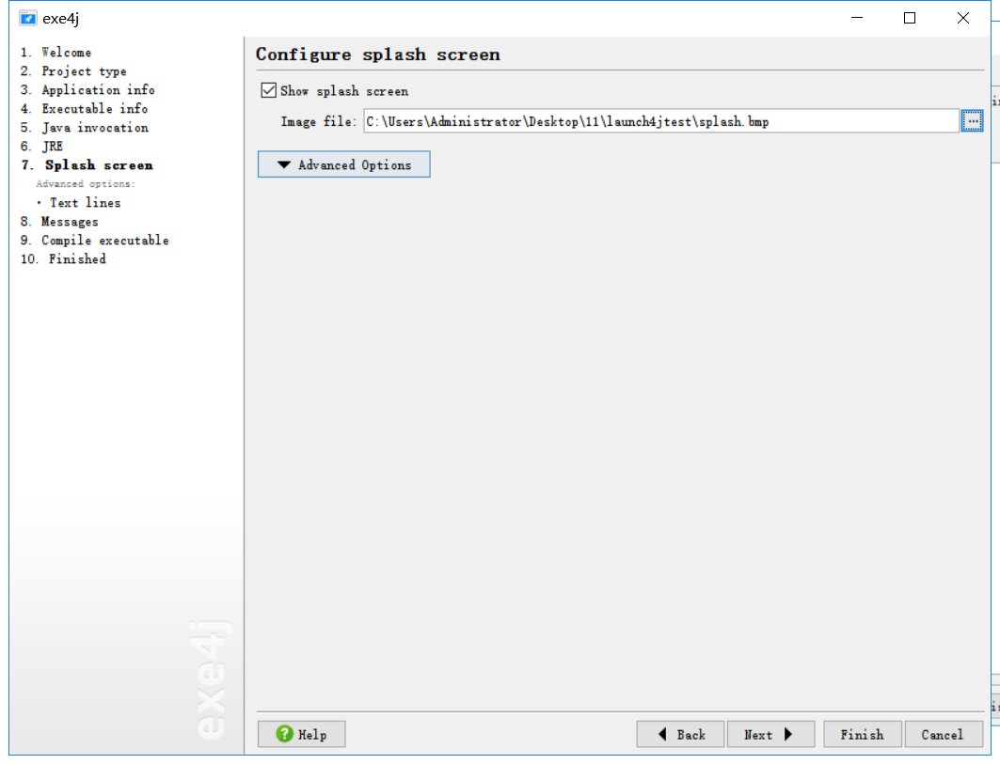

# exe4j打包jar为exe

> 根据实测，launch4j更加好用，推荐用launch4j打包。打包后的结果都一样，都是exe执行程序。
>
> 根据实测，和exe4j一样。在没有安装jre的windows环境下，并不能运行。需要考虑在打包jre或者在用Inno Setup打包exe的时候去添加jre环境。
>
> 先需要安装exe4j：
>
> 链接：https://pan.baidu.com/s/11MdqPj6smGEXxWTVw50duA 
> 提取码：cepb 

## 配置

如果有现成的配置文件可以直接open。没有的话直接点击`next`按钮

Executable name是打包成exe后执行的exe文件的文件名称。

如果系统是64位系统，那么需要选中

添加需要打成jar包为exe的jar包， 需要配置VM参数`-Dfile.encoding=utf-8`，否则日志会乱码。Main class from需要修改为`org.springframework.boot.loader.JarLauncher`否则会报主类找不到。

配置jar同目录下的jre

添加软件运行时的启动页面

依次经过9，10步骤后，编译成功，点击图下按钮，可以启动客户端。

> 但是会提示如下对话框，比较烦人。还没找到方法如何去除掉。

