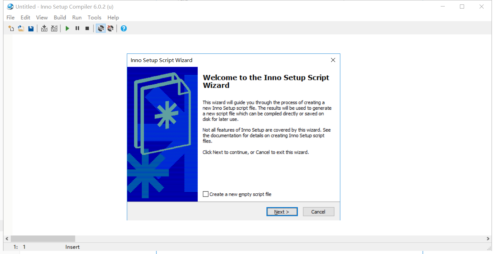
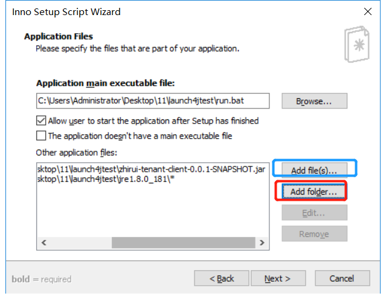
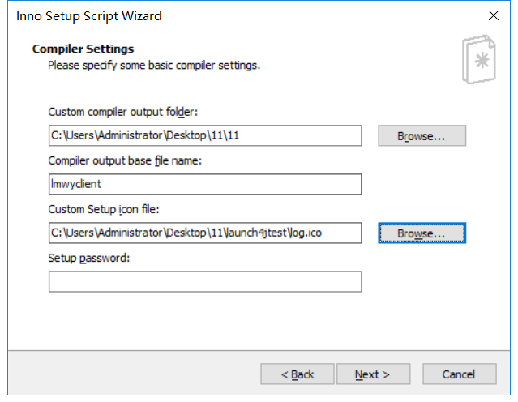

# Inno Setup打包bat

> Inno Setup工具能将jar或bat等运行程序打包成安装包。可以打包一些安装的信息。

先需要安装Inno Setup

> 链接：https://pan.baidu.com/s/11MdqPj6smGEXxWTVw50duA 
> 提取码：cepb 

file->new




点击`add file`按钮将jar包添加

点击`add folder`按钮将jre添加




添加个说明文件，看起来正式些，内容可以随便写。


准备一个ico图标，显示的时候好看些



后面都默认选项即可


run.bat的配置如下：

```basic
%1 mshta vbscript:CreateObject("WScript.Shell").Run("%~s0 ::",0,FALSE)(window.close)&&exit

tskill java

cd bin

java -jar ../zhirui-tenant-client-0.0.1-SNAPSHOT.jar
```

每次点击`run.bat`先会删除掉正在运行的进程，然后重启。

因为上面打包的步骤添加jre到安装包。所以`zhirui-tenant-client-0.0.1-SNAPSHOT.jar`会在jre的包里面，启动的时候cd 到jre的bin目录下，就可以执行到java.exe，再执行java -jar即可启动程序。