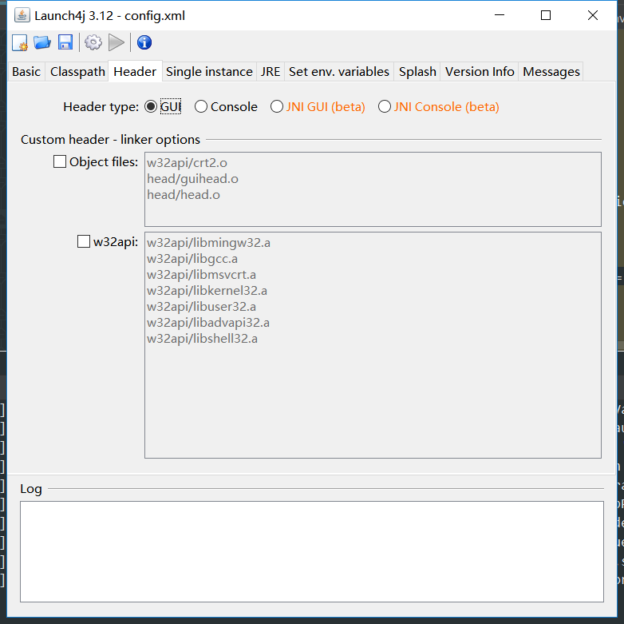
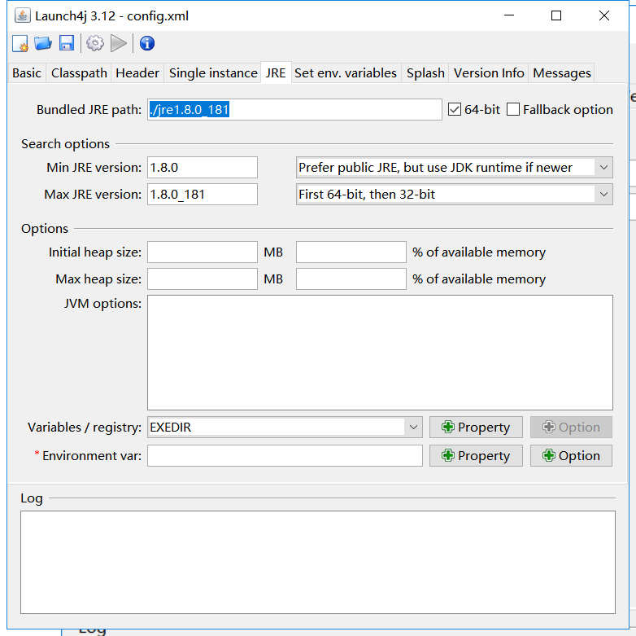

# launch4j打包jar为exe

>根据实测，在没有安装jre的windows环境下，并不能运行。需要考虑在打包jre或者在用Inno Setup打包exe的时候去添加jre环境。

## 安装launch4j

先需要安装launch4j

>链接：https://pan.baidu.com/s/11MdqPj6smGEXxWTVw50duA 
>提取码：cepb 

参考：<https://javatidbits.wordpress.com/2016/04/21/creating-exe-files-for-java-apps-using-launch4j/>

安装后，开始配置：

## 配置

### Basic配置:

* Outputfile: 打包后exe的目录和程序文件名为`testlaunch.exe`

* jar： 指定打包后的jar包
* Icon：指定运行程序显示的图标文件，可以将公司log或者产品log转换成ico格式

### Header配置指定启动方式

一般选GUI或者Console

### Single instance配置

该配置用于限制程序启动的个数，也就是任务管理器中只能存在一个该程序的进程。推荐配置。

### JRE配置

指定JRE的路径，且设置最小和最大的JRE版本

> 如果程序或者日志出现乱码，可以尝试添加如下JVM options参数
>
> `-Dfile.encoding=utf-8`

### Splash配置

设置后，双击打包后的exe程序，在程序启动时会显示设置的bmp图像。

### Messages配置

可以设置启动时的各种提示，根据我的实测，不支持中文，且虽然成功启动后仍会提示`startup error`里面的信息。

