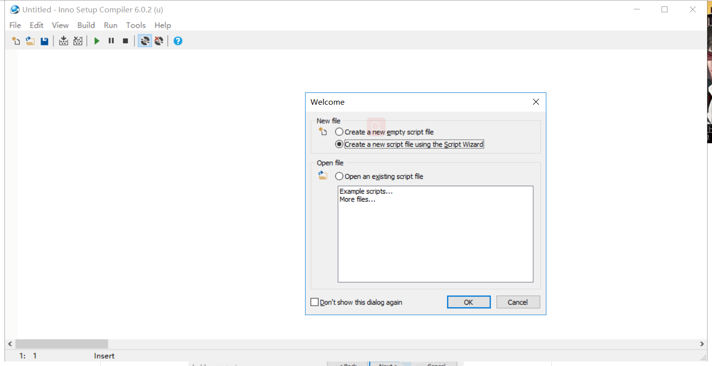
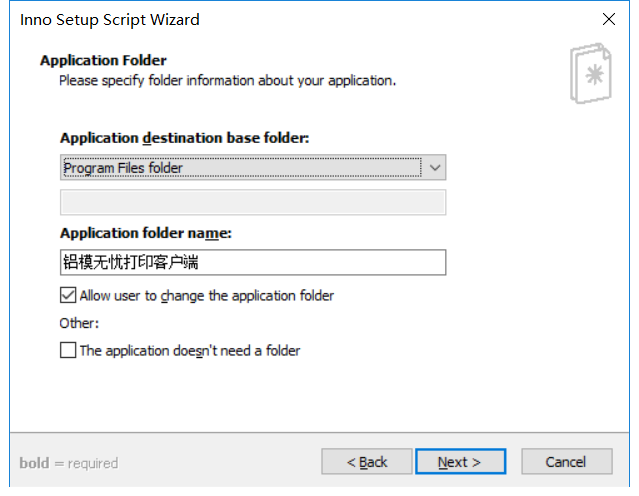
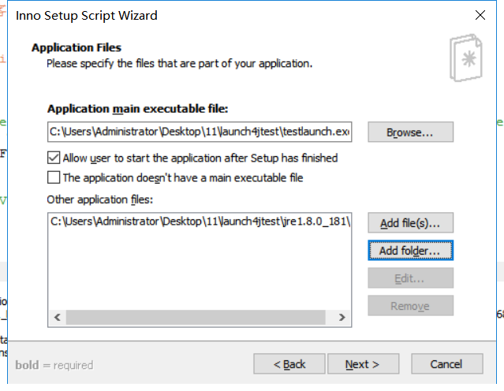
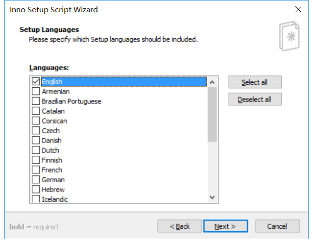
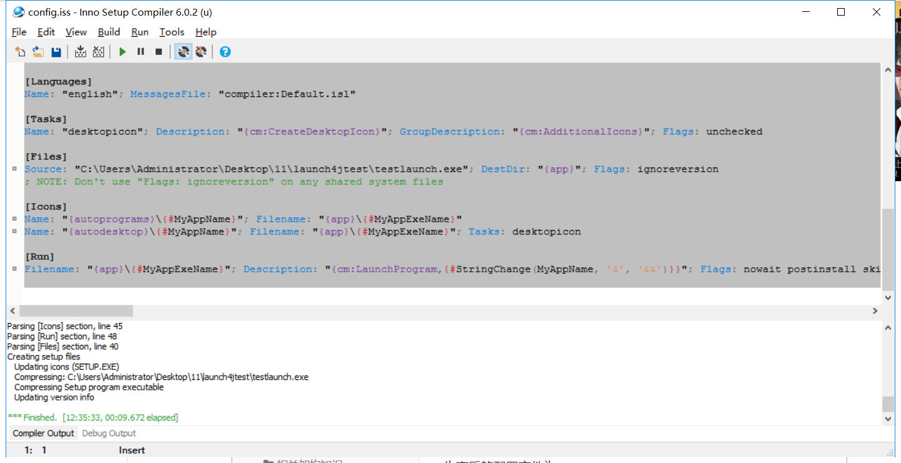

# Inno Setup打包exe

> Inno Setup工具能将jar或bat等运行程序打包成安装包。可以打包一些安装的信息。

先需要安装Inno Setup

>链接：https://pan.baidu.com/s/11MdqPj6smGEXxWTVw50duA 
>提取码：cepb 

双击安装程序后一步步点下去即可，安装成功后显示如下页面，






选择已经通过exe4j或者launch4j将jar转换后的exe文件，且添加jre









生产后的配置文件为：

```properties
; Script generated by the Inno Setup Script Wizard.
; SEE THE DOCUMENTATION FOR DETAILS ON CREATING INNO SETUP SCRIPT FILES!

#define MyAppName "铝模无忧打印客户端"
#define MyAppVersion "1.5"
#define MyAppPublisher "龙小南"
#define MyAppURL "http://lmwy.zhirui-tech.com/wms/#/"
#define MyAppExeName "testlaunch.exe"

[Setup]
; NOTE: The value of AppId uniquely identifies this application. Do not use the same AppId value in installers for other applications.
; (To generate a new GUID, click Tools | Generate GUID inside the IDE.)
AppId={{C3E3E27A-3D4F-4C6E-9C09-F10159D0C0D1}
AppName={#MyAppName}
AppVersion={#MyAppVersion}
;AppVerName={#MyAppName} {#MyAppVersion}
AppPublisher={#MyAppPublisher}
AppPublisherURL={#MyAppURL}
AppSupportURL={#MyAppURL}
AppUpdatesURL={#MyAppURL}
DefaultDirName={autopf}\{#MyAppName}
DisableProgramGroupPage=yes
InfoBeforeFile=C:\Users\Administrator\Desktop\11\innosetup\licence.txt
; Uncomment the following line to run in non administrative install mode (install for current user only.)
;PrivilegesRequired=lowest
OutputDir=C:\Users\Administrator\Desktop\11\innosetup
OutputBaseFilename=mysetup
SetupIconFile=C:\Users\Administrator\Desktop\11\launch4jtest\log.ico
Compression=lzma
SolidCompression=yes
WizardStyle=modern

[Languages]
Name: "english"; MessagesFile: "compiler:Default.isl"

[Tasks]
Name: "desktopicon"; Description: "{cm:CreateDesktopIcon}"; GroupDescription: "{cm:AdditionalIcons}"; Flags: unchecked

[Files]
Source: "C:\Users\Administrator\Desktop\11\launch4jtest\testlaunch.exe"; DestDir: "{app}"; Flags: ignoreversion
; NOTE: Don't use "Flags: ignoreversion" on any shared system files

[Icons]
Name: "{autoprograms}\{#MyAppName}"; Filename: "{app}\{#MyAppExeName}"
Name: "{autodesktop}\{#MyAppName}"; Filename: "{app}\{#MyAppExeName}"; Tasks: desktopicon

[Run]
Filename: "{app}\{#MyAppExeName}"; Description: "{cm:LaunchProgram,{#StringChange(MyAppName, '&', '&&')}}"; Flags: nowait postinstall skipifsilent


```


