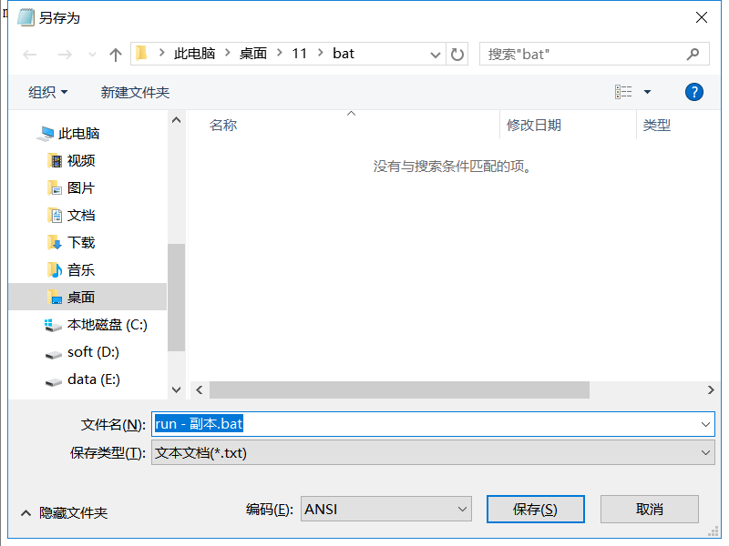

编辑bat文件

* 第一行：启动成功后关闭cmd窗口
* 第二行：删除当前所有的java进程
* 第三行四行：进入指定目录执行java -jar命令
* 第五行：提示程序运行成功

```basic
%1 mshta vbscript:CreateObject("WScript.Shell").Run("%~s0 ::",0,FALSE(window.close)&&exit

tskill java

cd bin

java -jar ../zhirui-tenant-client-0.0.1-SNAPSHOT.jar

msg %username% /w /v 铝模无忧客户端 启动成功！
```


另存时保存为`ANSI`格式

