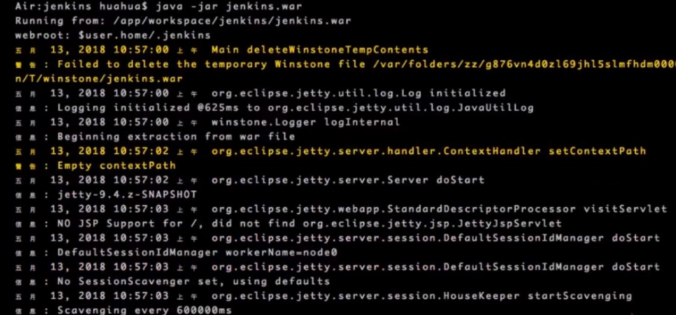
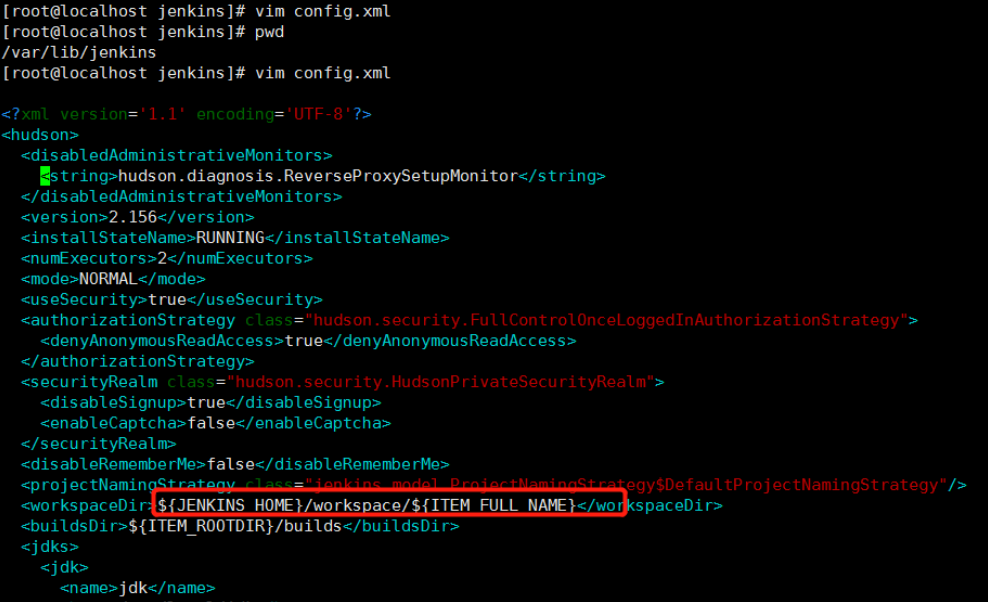

# jenkins安装和基本配置

[TOC]

官网地址：www.jenkins.io

## docker方式安装


1. 先安装docker

2. 启动镜像

   ```shell
   docker run \
     -u root \
     --rm \
     -d \
     -p 8080:8080 \
     -p 50000:50000 \
     -v /data/jenkins:/var/jenkins_home \
     -v /var/run/docker.sock:/var/run/docker.sock \
     --privileged=true \
     jenkinsci/blueocean
   ```

   > 参考：<https://jenkins.io/zh/doc/book/installing/>
   >
   > 运行是可能会报错`Permission Denied`，所以加上了`--privileged=true \`，参考：<https://www.jianshu.com/p/1ed499037b02>


## war包方式安装


下载后，使用命令`nohup java -jar jenkins.war &`运行



运行后访问地址为：`localhost:8080`


通过 `ps -ef | grep jenkins`查找到项目路径

```shell
[root@localhost ~]# ps -ef | grep jenkins
jenkins    1445      1  0 Apr08 ?        10:21:30 /usr/local/jdk/bin/java -Dcom.sun.akuma.Daemon=daemonized -Djava.awt.headless=true -DJENKINS_HOME=/var/lib/jenkins -jar /usr/lib/jenkins/jenkins.war --logfile=/var/log/jenkins/jenkins.log --webroot=/var/cache/jenkins/war --daemon --httpPort=8989 --debug=5 --handlerCountMax=100 --handlerCountMaxIdle=20
root      89082  88082  0 13:07 pts/0    00:00:00 grep --color=auto jenkins
```

上文中显示`-DJENKINS_HOME=/var/lib/jenkins`, 我们去查看下基本配置。



请记住这个`workspaceDir`路径

