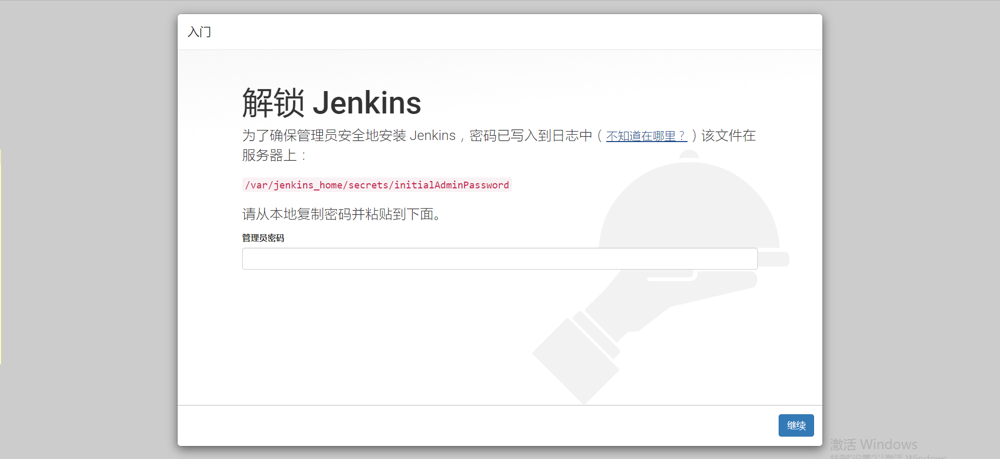
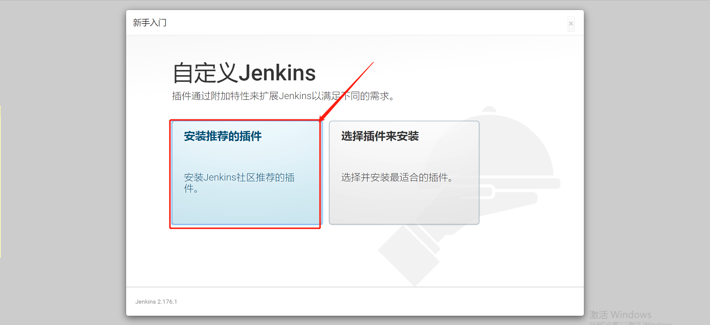
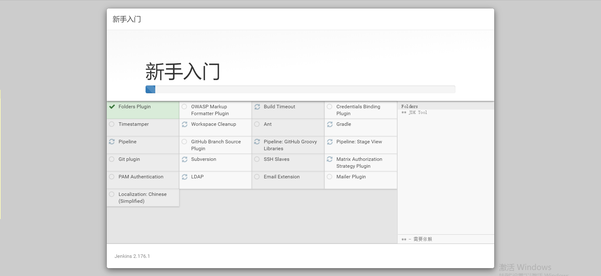

## 在启动后

访问jenkins： [http://192.168.0.231:8080](http://192.168.0.231:8080/)

第一次解锁需要复制密码：

> 因为我是通过docker安装的，所以，密码文件在挂载的目录下面
>
> [root@test1 secrets]# vim /data/jenkins/secrets/initialAdminPassword 
>
> 8079fb5d3e3f444d857fa5c8e7add6e9

点击上图【继续】后，点击【安装推荐的插件】

插件正在安装中，稍等片刻

