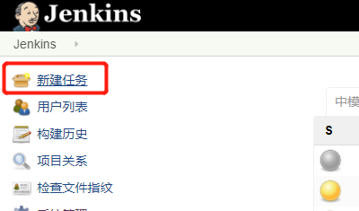
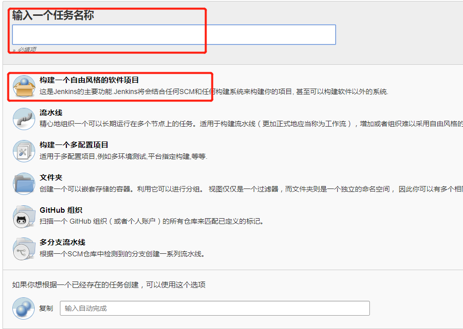
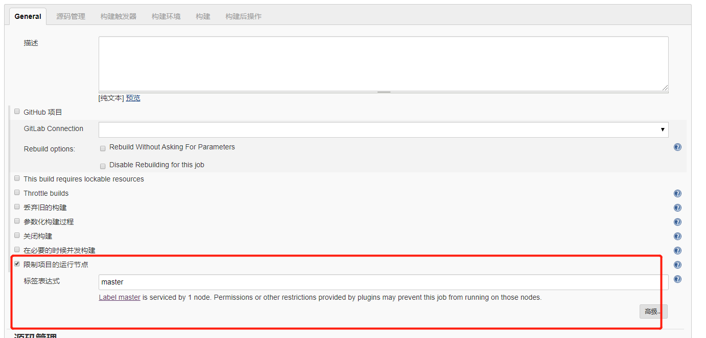
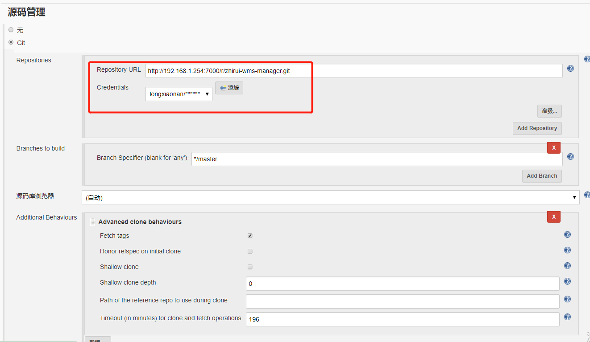
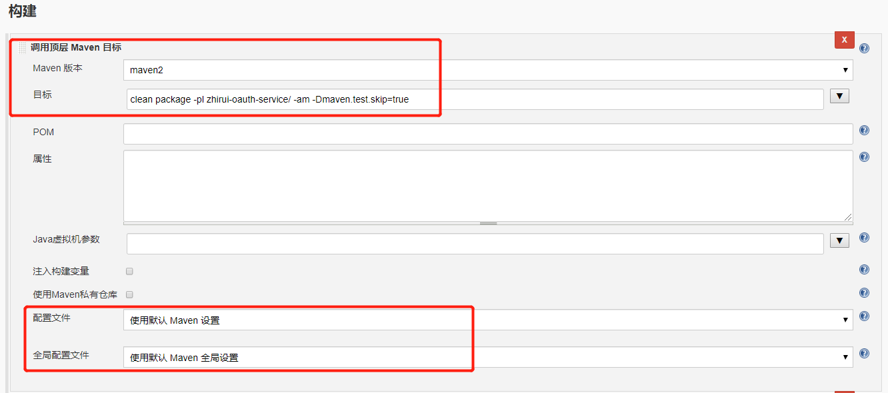
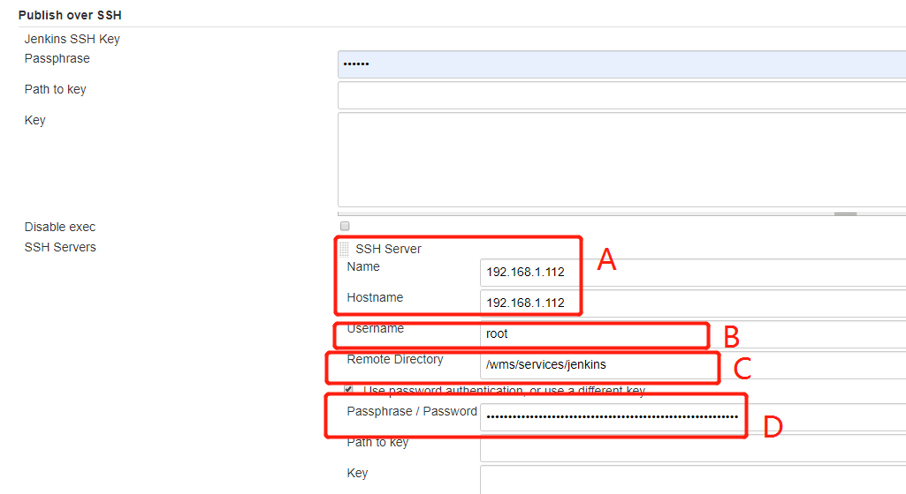
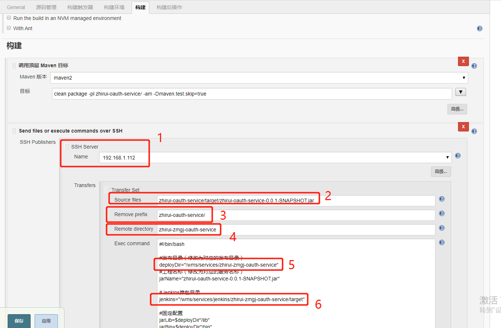
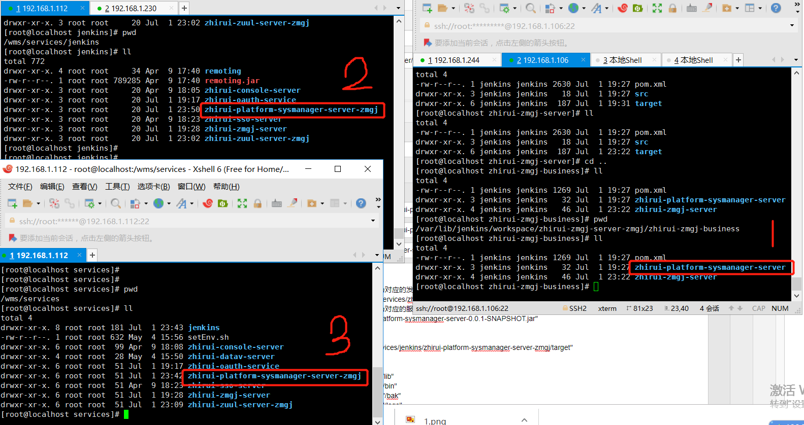

# 构建任务-SSH Server方式

该构建方式基于插件[Publish Over SSH](http://wiki.jenkins-ci.org/display/JENKINS/Publish+Over+SSH+Plugin)，我叫做`Publish插件方式`。该方式jenkins服务器打包成jar再推送到模板服务器进行运行。

点击新建任务：





## General基本配置

SSH 方式指定运行的节点为`master`



## 源码管理

需要去git拉取代码然后编译运行，需要`添加`身份信息用于访问git




## 构建

### 调用顶层Maven目标

* maven版本

  在【系统设置】【全局工具配置】中配置了maven环境，`maven2`是添加的maven环境的名称

* 目标

  通过maven命令进行单个模块的构建

  ```shell
  clean package -pl zhirui-zuul-server/ -am -Dmaven.test.skip=true
  ```

  如果是二级子模块，构建命令如下：

  ```shell
  clean package -pl zhirui-wms-business/zhirui-handle-file-server/ -am -Dmaven.test.skip=true
  ```
  
* 配置文件和全局配置

  选择默认的maven设置，也就是在【系统设置】【全局工具配置】配置的maven环境。



### Send files or execute commands over SSH

这里配置的是jenkins插件[Publish Over SSH](http://wiki.jenkins-ci.org/display/JENKINS/Publish+Over+SSH+Plugin)的参数配置。用于配置插件推送到模板应用服务器后的操作，**好几个路径配置比较容易混淆，稍微理解下，然后自己多试试**。

> 在执行该步骤之前，需要在【系统管理】【系统设置】中添加的SSH server配置如下：
>
> 
>
> **说明如下：**
>
> A：SSH Server业务服务器的ip
>
> B和D：jenkins服务器推送jar到业务服务器的用户帐号密码信息
>
> C：推送后到SSH Server后的jar存放的`远端基础目录`，下文我会称之为`远端基础目录`

在下面的`SSH Server`中需要添加在【系统管理】【系统设置】中添加的SSH server配置的SSH Server：

> **1红框框下有个高级按钮，需要检查是否取消了密码配置**



**按上图的红框框编号进行说明：**

1. SSH Server 的name，表示在哪个服务器执行
2. 基于【系统管理】【系统设置】中jenkins中的`主目录``/var/lib/jenkins`下的`workspace`，进行编译后的jar包，位于jenkins服务器工作空间下。如，目录全称实际是`/var/lib/jenkins/workspace/zhirui-zmgj-oauth-service/zhirui-oauth-service/target/zhirui-oauth-service-0.0.1-SNAPSHOT.jar`。jenkins默认拼上了`/var/lib/jenkins/workspace/zhirui-zmgj-oauth-service/`, 其中`zhirui-zmgj-oauth-service`是本次构建的`任务名称`。
3. 基于2中的目录，将`target`前面的这个前缀去掉。
4. `Remote Directory`是一个相对路径， 需要和本次构建`任务名称`保持一致，maven编译后会将jar传到目标服务器（也就是`192.168.1.112`服务器）`远端基础目录` + `任务名称`的目录下，不一致会导致后面的shell脚本找不到jar。如，会将jar copy到的完全路径实际是`/wms/services/jenkins/zhirui-zmgj-oauth-service/target`，也就是下图红框框6位置的路径。
5. 应用服务器部署运行的目录
6. 相对4中相对路径下jar的完全路径。用于copy到5中进行部署执行。

> 一个直观的图可以显示他们之间的关系：
>
> 1. jenkins服务器打包成jar后存放的在`主目录``workspace`下的位置
> 2. 推送到业务服务器后，基于`远端基础目录`后的位置
> 3. 业务服务器运行jar时，会执行shell脚本，执行后，拷贝到该位置后启动
>
> 
>
> 本图和上图进行关联对应：
>
> 1. 1红框框和上图1红框框对应，填写的是基于`主目录`+`workspace`后的想到路径
> 2. 2.1,2.2红框框和上图2红框框对应，填写的是推送到应用服务器后jar的路径。2.1红框框是基于`远端基础目录`的路径，jar安装2.1的配置推送到目标服务器，结果就是2.2红框框的路径。
> 3. 3红框框和上图3红框框对应，是图中`Exec command`里面配置的shell脚本执行后jar会拷贝到3红框框的路径进行执行，是程序实际的运行路径。
>
> 
>
> Exec command的脚本如下：
>
> > 脚本说明：
> >
> > 1. 按照实际情况修改几个`发布目录`，`工程名称`，`Jenkins推包目录`。
> >2. `jarBin`目录下需要放置`启动shell脚本`，先需要将两个脚本 start.sh, 和 restart.sh 创建在/var目录下，[点击查看启动shell脚本]()。
>
> ```shell
> #!/bin/bash
> 
> #发布目录（修改为对应的发布目录）
> deployDir="/wms/services/zhirui-wms-erp-server"
> #工程名称（修改为对应的服务名称）
> jarName="zhirui-wms-erp-server-0.0.1-SNAPSHOT.jar"
> 
> #Jenkins推包目录
> jenkins="/wms/services/jenkins/zhirui-wms-erp-server/target"
> 
> #固定配置
> jarLib=$deployDir"/lib"
> jarBin=$deployDir"/bin"
> jarBak=$deployDir"/bak"
> jarLog=$deployDir"/logs"
> 
> #目录构建
> if [ ! -d ${jarLib}"/" ];then
> mkdir ${jarLib} -p
> fi
> 
> if [ ! -d ${jarBin}"/" ];then
> mkdir ${jarBin} -p
> fi
> 	
> if [ ! -d ${jarBak}"/" ];then
> mkdir ${jarBak} -p
> fi
> 	
> if [ ! -d ${jarLog}"/" ];then
> mkdir ${jarLog} -p
> fi
> 
> echo "**********************基础配置信息***********************"
> java -version
> echo "发布项目："${jarName}
> echo "发布目录："${deployDir}
> echo "bin目录："${jarBin}
> echo "lib目录："${jarLib}
> echo "bak目录："${jarBak}
> echo "日志目录："${jarLog}
> echo "*******************************************************"
> 
> #检查新报是否已经推送到本地，如果存在则进行后续操作
> if [ "$(ls ${jenkins}/${jarName} 2> /dev/null | wc -l)" != "0" ]; then
> 	#备份文件
> 	oldJarName="`ls ${jarLib} | grep .jar | sort -nr | head -1`"
> 	echo "开始备份Jar包："${jarLib}"/"${oldJarName}
> 	bakJarName=${oldJarName}$(date +%s)
> 	echo "备份"${jarLib}"/"${oldJarName}"到"${jarBak}"/"${bakJarName}
> 	cd ${deployDir}
> 	if [ "$(ls "lib/"*.jar 2> /dev/null | wc -l)" != "0" ]; then
> 		mv ${jarLib}"/"${oldJarName} ${jarBak}"/"${bakJarName}
> 		echo "备份Jar包成功"
> 	else
> 		echo "无Jar可以备份"
> 	fi
> 	#复制新的包到指定的目录
> 	cd ${jenkins}
> 	echo "迁移新包到目录："${jarLib}
> 	cp ${jenkins}"/"${jarName} ${jarLib}
> 	#重启服务
> 	cd ${jarBin}
> 	#将start.sh和restart.sh从/var复制到项目的bin目录下
>      cp /var/env/start.sh .
>      cp /var/env/restart.sh .
>      chmod 775 *
> 	sh ./restart.sh
> else
> 	echo "找不到发布包：${jenkins}/${jarName}"
> 	exit 1
> fi
> ```
>
> 