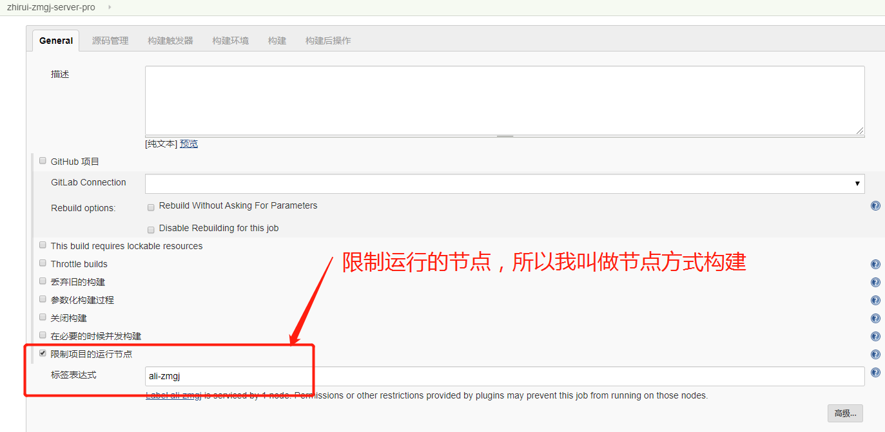
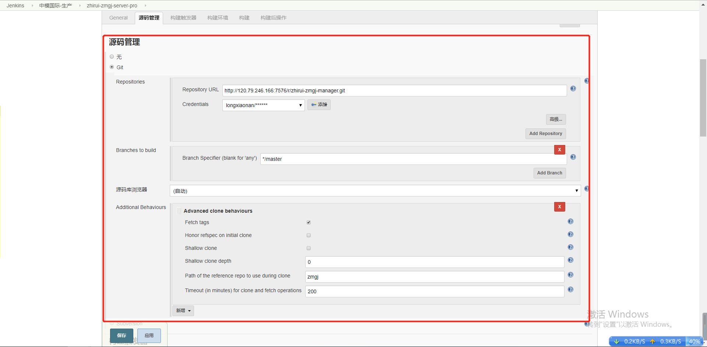
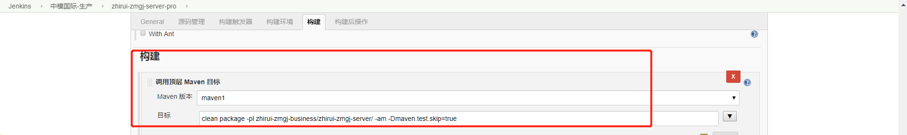
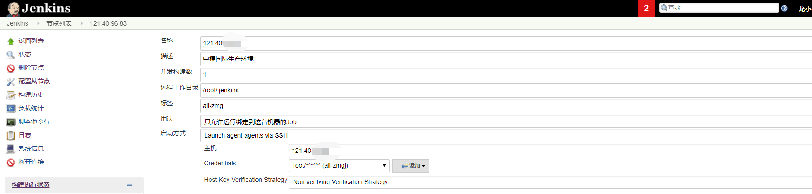
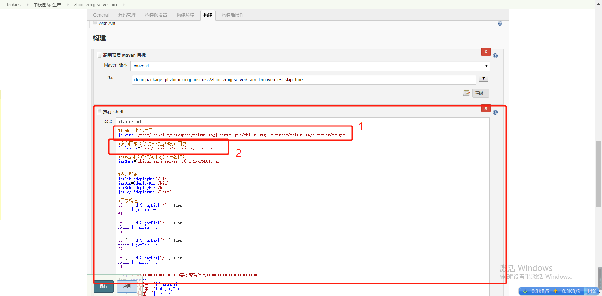

# 构建任务-节点方式

该方式需要先配在`系统管理`配置节点，然后在远程管理进行打包和启动。

## 指定运行节点，节点在【系统管理】【节点管理】中配置

> 上文的`SSH Server构建方式`是指定为master节点



## 同SSH方式，指定git的url和认证信息

> git 的基本信息信息在【系统管理】【全局工具配置】中进行指定



## 配置构建

### 调用顶层Maven目标

> 同SSH方式。

- maven版本

  在【系统设置】【全局工具配置】中配置了maven环境，`maven1`是添加的maven环境的名称

- 目标

  通过maven命令进行单个模块的构建

  ```shell
  clean package -pl zhirui-zuul-server/ -am -Dmaven.test.skip=true
  ```

  如果是二级子模块，构建命令如下：

  ```shell
  clean package -pl zhirui-zmgj-business/zhirui-zmgj-server/ -am -Dmaven.test.skip=true
  ```



### 执行shell

> 因为通过指定节点运行，所以无需通过SSH的那个插件进行部署。【系统管理】【节点管理】节点配置：
>
> 

1. 基于上图节点配置中的`远程工作目录`, jenkins会在`远程工作目录 + workspace + 任务名称`下进行编译。所以jar的路径还需要再拼上git的项目路径。
2. 实际部署运行的的路径



> 执行shell中的命令如下：
>
> ```shell
> #!/bin/bash
> 
> #Jenkins推包到应用服务器的目录
> jenkins="/root/.jenkins/workspace/zhirui-zmgj-server-pro/zhirui-zmgj-business/zhirui-zmgj-server/target"
> 
> #发布目录（修改为对应的发布目录）
> deployDir="/wms/services/zhirui-zmgj-server"
> 
> #jar名称（修改为对应的jar名称）
> jarName="zhirui-zmgj-server-0.0.1-SNAPSHOT.jar"
> 
> 
> #固定配置
> jarLib=$deployDir"/lib"
> jarBin=$deployDir"/bin"
> jarBak=$deployDir"/bak"
> jarLog=$deployDir"/logs"
> 
> #目录构建
> if [ ! -d ${jarLib}"/" ];then
> mkdir ${jarLib} -p
> fi
> 
> if [ ! -d ${jarBin}"/" ];then
> mkdir ${jarBin} -p
> fi
> 	
> if [ ! -d ${jarBak}"/" ];then
> mkdir ${jarBak} -p
> fi
> 	
> if [ ! -d ${jarLog}"/" ];then
> mkdir ${jarLog} -p
> fi
> 
> echo "**********************基础配置信息***********************"
> java -version
> echo "发布项目："${jarName}
> echo "发布目录："${deployDir}
> echo "bin目录："${jarBin}
> echo "lib目录："${jarLib}
> echo "bak目录："${jarBak}
> echo "日志目录："${jarLog}
> echo "*******************************************************"
> 
> #检查新报是否已经推送到本地，如果存在则进行后续操作
> if [ "$(ls ${jenkins}/${jarName} 2> /dev/null | wc -l)" != "0" ]; then
> 	#备份文件
> 	oldJarName="`ls ${jarLib} | grep .jar | sort -nr | head -1`"
> 	echo "开始备份Jar包："${jarLib}"/"${oldJarName}
> 	bakJarName=${oldJarName}$(date +%s)
> 	echo "备份"${jarLib}"/"${oldJarName}"到"${jarBak}"/"${bakJarName}
> 	cd ${deployDir}
> 	if [ "$(ls "lib/"*.jar 2> /dev/null | wc -l)" != "0" ]; then
> 		mv ${jarLib}"/"${oldJarName} ${jarBak}"/"${bakJarName}
> 		echo "备份Jar包成功"
> 	else
> 		echo "无Jar可以备份"
> 	fi
> 	echo "复制新的包到指定的目录"
> 	cd ${jenkins}
> 	echo "迁移新包到目录："${jarLib}
> 	cp ${jenkins}"/"${jarName} ${jarLib}
> 	echo "重启服务："${jarBin}
> 	cd ${jarBin}
> 	 #将start.sh和restart.sh从/var复制到项目的bin目录下
>      cp /var/env/start.sh .
>      cp /var/env/restart.sh .
>      chmod 775 *
> 	sh restart.sh
> else
> 	echo "找不到发布包：${jenkins}/${jarName}"
> 	exit 1
> fi
> ```
>
> 