# jenkins自动部署Spring Cloud服务实战

## 概述

jenkins是一个自动构建工具，在jenkins的服务器上指定配置一些应用服务器后，可以实现自动从git拉取代码，然

后将项目部署和启动到应用。本文的目的是想详尽介绍，如何配置整个的部署环境。

我整理了下公司真实环境的配置方式。仅供参考，本公司是小公司，如果有什么不足的地方欢迎指出，我好改进啊~

## 部署规划

### jenkins构建方式

* 节点方式

  通过jenkins配置的节点信息进行构建，后面有具体介绍。

  jenkins服务器配置简单，但是应用服务器需要安装`git`,`maven`。因为会在应用服务器进行构建

* Publish插件方式

  通过安装插件`Publish Over SSH`进行构建，后面有具体介绍。

  jenkisn服务器配置复杂，但是应用服务器只需安装jdk即可

### 服务器规划

| ip地址        | 类型          | 软件                  | 构建方式        |
| :------------ | ------------- | --------------------- | --------------- |
| 121.40.XX.XX  | 应用服务器    | jdk git maven         | 节点方式        |
| 192.168.1.112 | 应用服务器    | jdk                   | Publish插件方式 |
| 192.168.1.233 | 应用服务器    | jdk                   | Publish插件方式 |
| 192.168.1.254 | jenkins服务器 | jdk git maven jenkins | jenkins服务器   |
| 120.79.XX.XX  | 应用服务器    | jdk git maven         | 节点方式        |

## jenkins安装和启动

**官网：**<https://jenkins.io/zh/download/>

### docker方式安装

1. 先安装docker

   

2. 启动镜像

   ```shell
   docker run \
     -u root \
     --rm \
     -d \
     -p 8080:8080 \
     -p 50000:50000 \
     -v /data/jenkins:/var/jenkins_home \
     -v /var/run/docker.sock:/var/run/docker.sock \
     --privileged=true \
     jenkinsci/blueocean
   ```

   > 参考：<https://jenkins.io/zh/doc/book/installing/>
   >
   > 运行是可能会报错`Permission Denied`，所以加上了`--privileged=true \`，参考：<https://www.jianshu.com/p/1ed499037b02>

### war包方式安装

先需要下载war包：

地址：<https://jenkins.io/zh/download/>

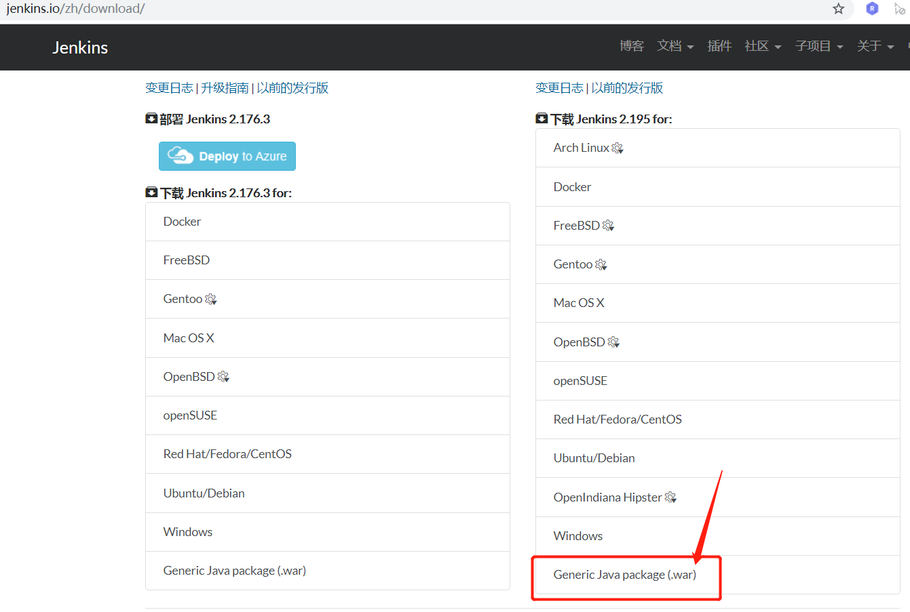

下载后，使用命令如下命令运行：

```shell
nohup java -jar jenkins.war &
```

通过 `ps -ef | grep jenkins`查找启动的进程：

```shell
[root@localhost ~]# ps -ef | grep jenkins
jenkins    1445      1  0 Apr08 ?        10:21:30 /usr/local/jdk/bin/java -Dcom.sun.akuma.Daemon=daemonized -Djava.awt.headless=true -DJENKINS_HOME=/var/lib/jenkins -jar /usr/lib/jenkins/jenkins.war --logfile=/var/log/jenkins/jenkins.log --webroot=/var/cache/jenkins/war --daemon --httpPort=8080 --debug=5 --handlerCountMax=100 --handlerCountMaxIdle=20
root      89082  88082  0 13:07 pts/0    00:00:00 grep --color=auto jenkins
```

上文中显示`-DJENKINS_HOME=/var/lib/jenkins`，这个是jenkins实际的工作目录。

> 如果需要指定更多的参数，比如指定端口进行启动，那么可以通过如下命令进行启动：
>
> ```shell
> java -Dcom.sun.akuma.Daemon=daemonized -Djava.awt.headless=true -DJENKINS_HOME=/var/lib/jenkins -jar /data/jenkins/jenkins.war --logfile=/var/logs/jenkins/jenkins.log --webroot=/var/cache/jenkins/war --daemon --httpPort=8989 --debug=5 --handlerCountMax=100 --handlerCountMaxIdle=20
> ```

### 启动和初始化

#### 相关的启停命令

```shell
$ http://yourdomain:8080/exit        # 停止服务
$ http://yourdomain:8080/restart     # 重启服务
$ http://yourdomain:8080/reload      # 重新加载配置信息
```

#### 初始化jenkins

访问jenkins： [http://localhost:8080](http://localhost:8080/)

第一次解锁需要复制密码：

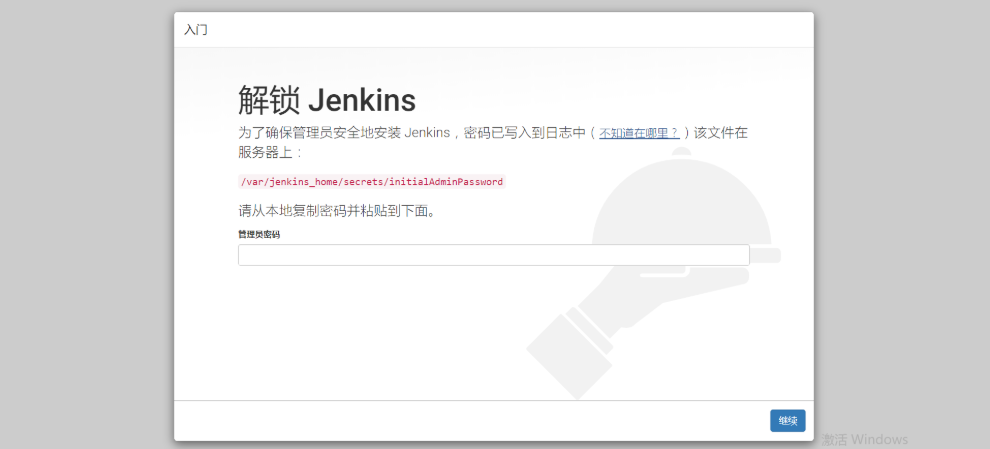

上图有显示密码在服务器中的位置。如果是通过docker安装的，那么密码文件在挂载的目录下面

```shell
# vim /data/jenkins/secrets/initialAdminPassword 

8079fb5d3e3f444d857fa5c8e7add6e9
```

点击上图【继续】后，点击【安装推荐的插件】

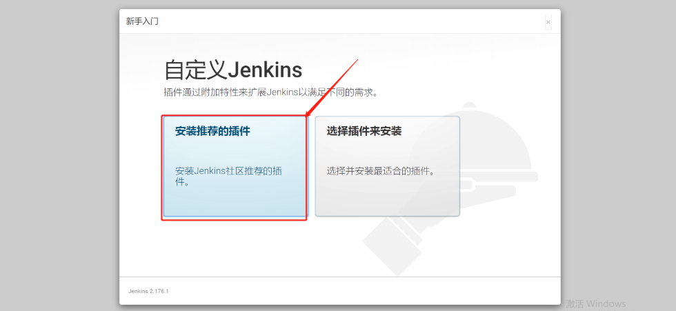

插件正在安装中，稍等片刻

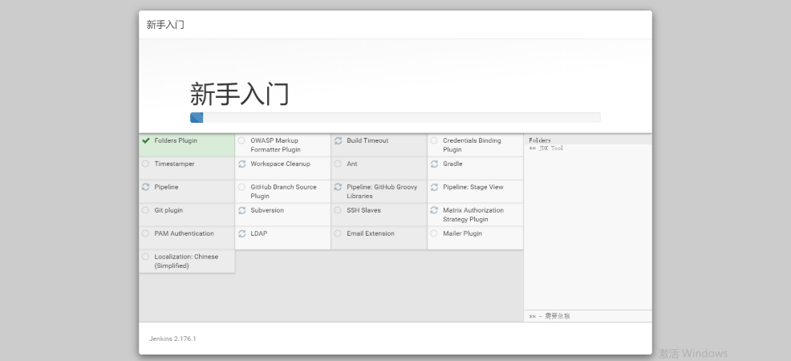

## 系统管理

登录jenkins后，右边菜单中有个【系统管理】菜单，点击进去

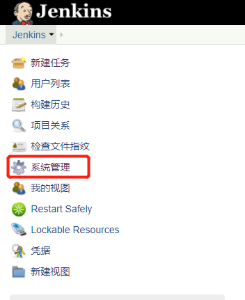

下图的红框框部分是部署必须设置项，其他的看情况设置：

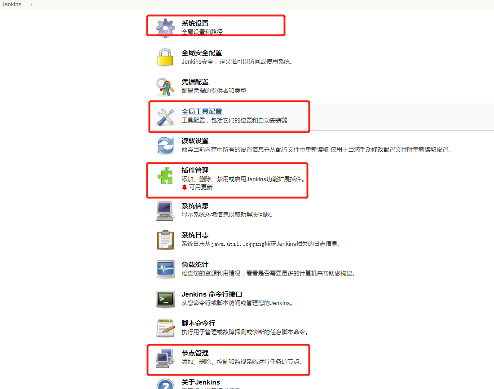

下面我们具体来设置这几项。

### 系统设置

这里是默认的一些基本信息

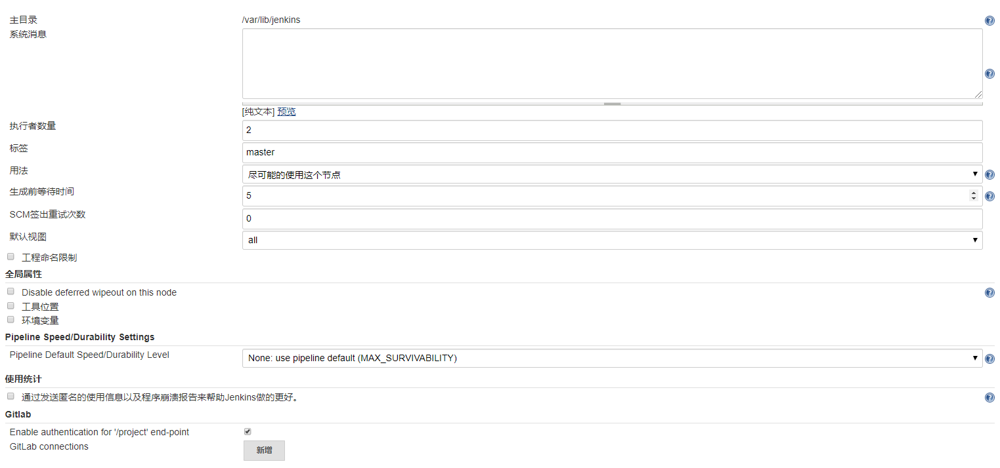

配置访问信息

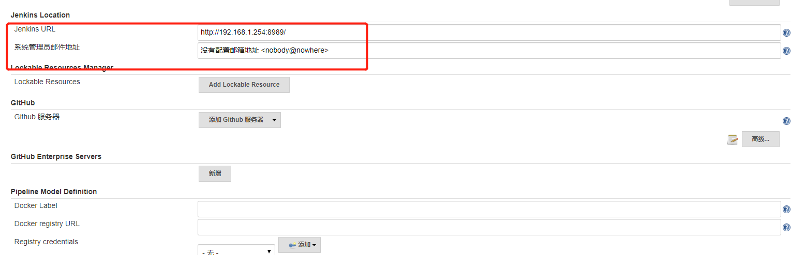

配置`pulish over ssh`插件，需要配置用户名和密码，在应用服务器`192.168.1.233`创建目录`/wms/services/jenkins`，点击`Test Configuration`进行验证，提示`Success`才是验证成功。

​	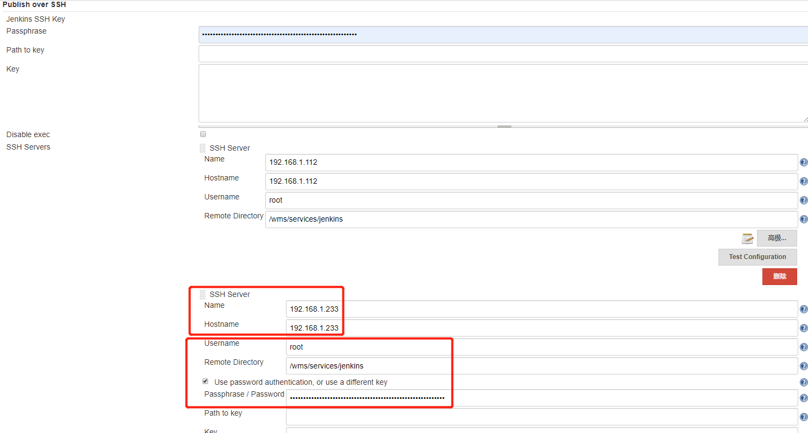

> SSH Server节点中目录`/wms/services/jenkins`非常关键。
>
> 在后面的构建任务中，的两个任务就是基于该目录的。
>
> 当然，如果**不是通过SSH Publishers插件来构建**那么这里的SSH Server节点配置不配置都没关系。
>
> 192.168.1.112应用服务器是`Publish插件方式`构建，会关联这里配置的SSH Server信息：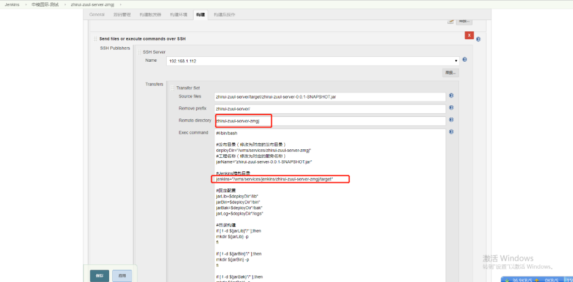

### 全局工具配置

jenkisn服务器需要安装maven，jdk，git。我是预先安装的，您没预先安装也可以试试勾选这里的自动安装。

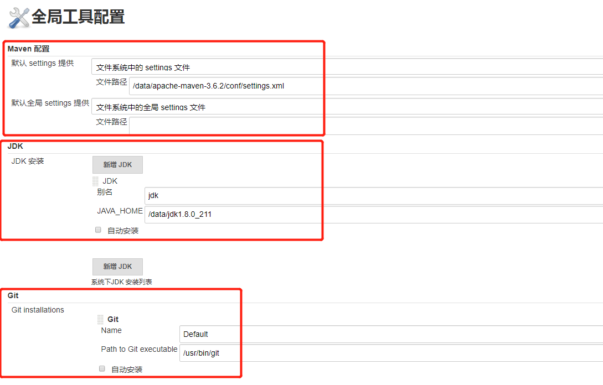

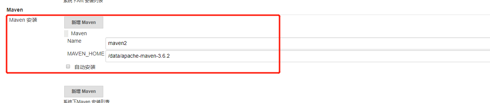

### 插件管理

确保`git`和`Publish Over SSH`插件安装成功

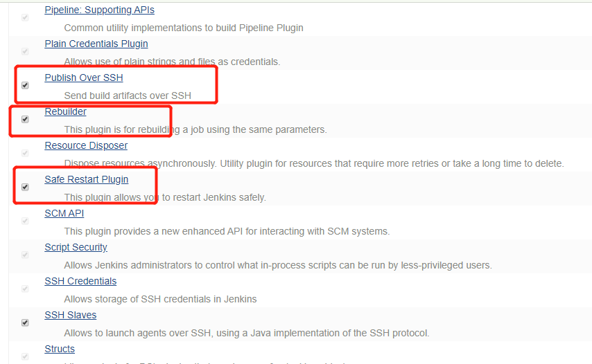

### 节点管理

回顾上文的`服务器规划` ，其中`120.79.XX.XX`和`121.40.XX.XX`是`节点方式`进行构建，所以需要在这里单独配置节点：

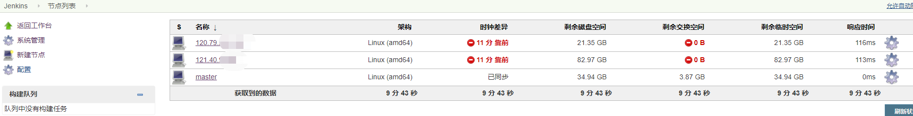

以121.40.XX.XX为例，点击右边`齿轮`后，再点击`配置从节点`，可以查看到需要配置的节点情况：

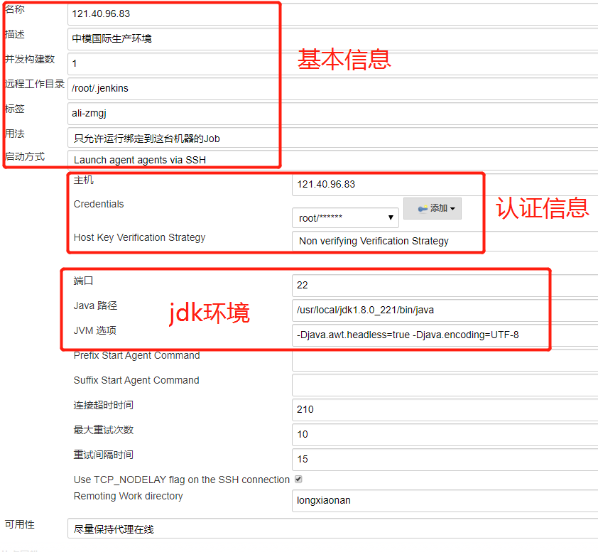

> JVM选项：-Djava.awt.headless=true -Djava.encoding=UTF-8

配置环境变量

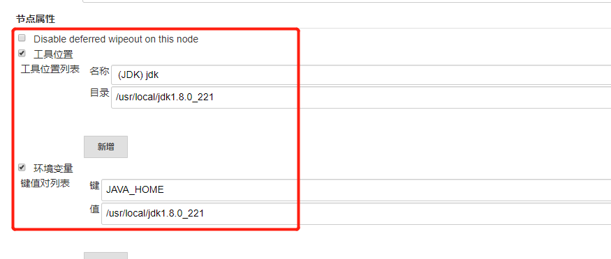

保存后，返回到节点列表。点击右上角的`允许自动刷新`，发现已经正常连接上，效果如上午的节点列表。

## 开始构建

系统管理设置好后才能开始进行构建，我总结了两种构建方式

### 构建方式一：节点方式

该方式需要先配在`系统管理`配置节点，然后在远程管理进行打包和启动。

#### General基本配置

指定运行节点，节点在【系统管理】【节点管理】中配置

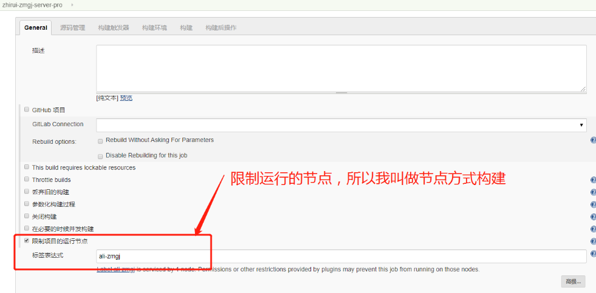

#### 源码管理

同SSH方式，指定git的url和认证信息

> git 的基本信息信息在【系统管理】【全局工具配置】中进行指定


#### 配置构建

##### 调用顶层Maven目标

> 同SSH方式。

- maven版本

  在【系统设置】【全局工具配置】中配置了maven环境，`maven1`是添加的maven环境的名称

- 目标

  通过maven命令进行单个模块的构建

  ```shell
  clean package -pl zhirui-zuul-server/ -am -Dmaven.test.skip=true
  ```

  如果是二级子模块，构建命令如下：

  ```shell
  clean package -pl zhirui-zmgj-business/zhirui-zmgj-server/ -am -Dmaven.test.skip=true
  ```


##### 执行shell

> 因为通过指定节点运行，所以无需通过SSH的那个插件进行部署。【系统管理】【节点管理】节点配置：
>
> 

1. 基于上图节点配置中的`远程工作目录`, jenkins会在`远程工作目录 + workspace + 任务名称`下进行编译。所以jar的路径还需要再拼上git的项目路径。
2. 实际部署运行的的路径


执行shell中的脚本如下：

```shell
#!/bin/bash

#Jenkins推包到应用服务器的目录
jenkins="/root/.jenkins/workspace/zhirui-zmgj-server-pro/zhirui-zmgj-business/zhirui-zmgj-server/target"

#发布目录（修改为对应的发布目录）
deployDir="/wms/services/zhirui-zmgj-server"

#jar名称（修改为对应的jar名称）
jarName="zhirui-zmgj-server-0.0.1-SNAPSHOT.jar"


#固定配置
jarLib=$deployDir"/lib"
jarBin=$deployDir"/bin"
jarBak=$deployDir"/bak"
jarLog=$deployDir"/logs"

#目录构建
if [ ! -d ${jarLib}"/" ];then
mkdir ${jarLib} -p
fi

if [ ! -d ${jarBin}"/" ];then
mkdir ${jarBin} -p
fi
	
if [ ! -d ${jarBak}"/" ];then
mkdir ${jarBak} -p
fi
	
if [ ! -d ${jarLog}"/" ];then
mkdir ${jarLog} -p
fi

echo "**********************基础配置信息***********************"
java -version
echo "发布项目："${jarName}
echo "发布目录："${deployDir}
echo "bin目录："${jarBin}
echo "lib目录："${jarLib}
echo "bak目录："${jarBak}
echo "日志目录："${jarLog}
echo "*******************************************************"

#检查新报是否已经推送到本地，如果存在则进行后续操作
if [ "$(ls ${jenkins}/${jarName} 2> /dev/null | wc -l)" != "0" ]; then
	#备份文件
	oldJarName="`ls ${jarLib} | grep .jar | sort -nr | head -1`"
	echo "开始备份Jar包："${jarLib}"/"${oldJarName}
	bakJarName=${oldJarName}$(date +%s)
	echo "备份"${jarLib}"/"${oldJarName}"到"${jarBak}"/"${bakJarName}
	cd ${deployDir}
	if [ "$(ls "lib/"*.jar 2> /dev/null | wc -l)" != "0" ]; then
		mv ${jarLib}"/"${oldJarName} ${jarBak}"/"${bakJarName}
		echo "备份Jar包成功"
	else
		echo "无Jar可以备份"
	fi
	echo "复制新的包到指定的目录"
	cd ${jenkins}
	echo "迁移新包到目录："${jarLib}
	cp ${jenkins}"/"${jarName} ${jarLib}
	echo "重启服务："${jarBin}
	cd ${jarBin}
	 #将start.sh和restart.sh从/var复制到项目的bin目录下
     cp /var/env/start.sh .
     cp /var/env/restart.sh .
     chmod 775 *
	sh restart.sh
else
	echo "找不到发布包：${jenkins}/${jarName}"
	exit 1
fi
```


### 构建方式二：Publish插件方式

该构建方式基于插件[Publish Over SSH](http://wiki.jenkins-ci.org/display/JENKINS/Publish+Over+SSH+Plugin)，我叫做`Publish插件方式`。该方式jenkins服务器打包成jar再推送到模板服务器进行运行。

#### 点击新建任务


#### General基本配置

SSH 方式指定运行的节点为`master`


#### 源码管理

需要去git拉取代码然后编译运行，需要`添加`身份信息用于访问git


#### 构建

##### 调用顶层Maven目标

- maven版本

  在【系统设置】【全局工具配置】中配置了maven环境，`maven2`是添加的maven环境的名称

- 目标

  通过maven命令进行父模块下子模块的打包命令：

  ```shell
  clean package -pl zhirui-zuul-server/ -am -Dmaven.test.skip=true
  ```

  如果是子模块下还有子模块，打包命令如下：

  ```shell
  clean package -pl zhirui-wms-business/zhirui-handle-file-server/ -am -Dmaven.test.skip=true
  ```

- 配置文件和全局配置

  选择默认的maven设置，也就是在【系统设置】【全局工具配置】配置的maven环境。


##### Send files or execute commands over SSH

这里配置的是jenkins插件[Publish Over SSH](http://wiki.jenkins-ci.org/display/JENKINS/Publish+Over+SSH+Plugin)的参数配置。用于配置插件推送到模板应用服务器后的操作，**好几个路径配置比较容易混淆，稍微理解下，然后自己多试试**。

> 在执行该步骤之前，需要在【系统管理】【系统设置】中添加的SSH server配置如下：
>
> 
>
> **说明如下：**
>
> A：SSH Server业务服务器的ip
>
> B和D：jenkins服务器推送jar到业务服务器的用户帐号密码信息
>
> C：推送后到SSH Server后的jar存放的`远端基础目录`，下文我会称之为`远端基础目录`

在下面的`SSH Server`中关联在【系统管理】【系统设置】中配置的SSH Server：


**按上图的红框框编号进行说明：**

1. SSH Server 的name，表示在哪个服务器执行
2. 基于【系统管理】【系统设置】中jenkins中的`主目录``/var/lib/jenkins`下的`workspace`，进行编译后的jar包，位于jenkins服务器工作空间下。如，目录全称实际是`/var/lib/jenkins/workspace/zhirui-zmgj-oauth-service/zhirui-oauth-service/target/zhirui-oauth-service-0.0.1-SNAPSHOT.jar`。jenkins默认拼上了`/var/lib/jenkins/workspace/zhirui-zmgj-oauth-service/`, 其中`zhirui-zmgj-oauth-service`是本次构建的`任务名称`。
3. 基于2中的目录，将`target`前面的这个前缀去掉。
4. `Remote Directory`是一个相对路径， 需要和本次构建`任务名称`保持一致，maven编译后会将jar传到目标服务器（也就是`192.168.1.112`服务器）`远端基础目录` + `任务名称`的目录下，不一致会导致后面的shell脚本找不到jar。如，会将jar copy到的完全路径实际是`/wms/services/jenkins/zhirui-zmgj-oauth-service/target`，也就是下图红框框6位置的路径。
5. 应用服务器部署运行的目录
6. 相对4中相对路径下jar的完全路径。用于copy到5中进行部署执行。

Exec command的脚本如下：

> 脚本说明：
>
> 1. 按照实际情况修改几个`发布目录`，`工程名称`，`Jenkins推包目录`。
> 2. `jarBin`目录下需要放置`启动shell脚本`，先需要将两个脚本 start.sh, 和 restart.sh 创建在/var/env目录下，[点击查看启动shell脚本]()。

```shell
#!/bin/bash

#发布目录（修改为对应的发布目录）
deployDir="/wms/services/zhirui-wms-erp-server"
#工程名称（修改为对应的服务名称）
jarName="zhirui-wms-erp-server-0.0.1-SNAPSHOT.jar"

#Jenkins推包目录
jenkins="/wms/services/jenkins/zhirui-wms-erp-server/target"

#固定配置
jarLib=$deployDir"/lib"
jarBin=$deployDir"/bin"
jarBak=$deployDir"/bak"
jarLog=$deployDir"/logs"

#目录构建
if [ ! -d ${jarLib}"/" ];then
mkdir ${jarLib} -p
fi

if [ ! -d ${jarBin}"/" ];then
mkdir ${jarBin} -p
fi
	
if [ ! -d ${jarBak}"/" ];then
mkdir ${jarBak} -p
fi
	
if [ ! -d ${jarLog}"/" ];then
mkdir ${jarLog} -p
fi

echo "**********************基础配置信息***********************"
java -version
echo "发布项目："${jarName}
echo "发布目录："${deployDir}
echo "bin目录："${jarBin}
echo "lib目录："${jarLib}
echo "bak目录："${jarBak}
echo "日志目录："${jarLog}
echo "*******************************************************"

#检查新报是否已经推送到本地，如果存在则进行后续操作
if [ "$(ls ${jenkins}/${jarName} 2> /dev/null | wc -l)" != "0" ]; then
	#备份文件
	oldJarName="`ls ${jarLib} | grep .jar | sort -nr | head -1`"
	echo "开始备份Jar包："${jarLib}"/"${oldJarName}
	bakJarName=${oldJarName}$(date +%s)
	echo "备份"${jarLib}"/"${oldJarName}"到"${jarBak}"/"${bakJarName}
	cd ${deployDir}
	if [ "$(ls "lib/"*.jar 2> /dev/null | wc -l)" != "0" ]; then
		mv ${jarLib}"/"${oldJarName} ${jarBak}"/"${bakJarName}
		echo "备份Jar包成功"
	else
		echo "无Jar可以备份"
	fi
	#复制新的包到指定的目录
	cd ${jenkins}
	echo "迁移新包到目录："${jarLib}
	cp ${jenkins}"/"${jarName} ${jarLib}
	#重启服务
	cd ${jarBin}
	#将start.sh和restart.sh从/var复制到项目的bin目录下
  cp /var/env/start.sh .
  cp /var/env/restart.sh .
  chmod 775 *
	sh ./restart.sh
else
	echo "找不到发布包：${jenkins}/${jarName}"
	exit 1
fi
```


##### 服务器目录和配置参数的对比关系：

感觉这里配置的路径很复杂，我再尝试说清楚，如果觉得比较绕，可以跳过，多测试下即可。

配置的参数：


说明：

1. 1红框框和下图1红框框对应，填写的是基于`主目录`+`workspace`后的想到路径

2. 2.1,2.2红框框和下图2红框框对应，填写的是推送到应用服务器后jar的路径。2.1红框框是基于`远端基础目录`的路径，jar安装2.1的配置推送到目标服务器，结果就是2.2红框框的路径。

3. 3红框框和下图3红框框对应，是图中`Exec command`里面配置的shell脚本执行后jar会拷贝到3红框框的路径进行执行，是程序实际的运行路径。

应用服务器和jinkins服务器的一些目录结构图：


说明：

1. jenkins服务器打包成jar后存放的在`主目录``workspace`下的位置。
2. 推送到业务服务器后，基于`远端基础目录`后的位置。
3. 业务服务器运行jar时，会执行shell脚本，执行后，拷贝到该位置后启动。

## 业务服务器环境配置

除了jenkins服务器外，其他的应用服务器都需要进行配置

### 设置程序用的环境变量

需要将setEnv.sh创建在/var/env目录下， 下文的启动和重启脚本会加载`/var/env/setEnv.sh`。

> 这些环境变量是在我程序的eureka server和configserver用到 , 所以需要配置。如果没用到可以不配置。

```shell
$vim setEnv.sh
#!/bin/bash
source ~/.bash_profile
export BUILD_ID=dontkillme
# for jdk env
#export JAVA_HOME=/usr/jdk1.8.0_112
#export PATH=$JAVA_HOME/bin:$JAVA_HOME/jre/bin:$PATH
#export CLASSPATH=$JAVA_HOME/lib:$JAVA_HOME/jre/lib:$CLASSPATH
# 指定profile
export ENV_OPTS="-Dconfig.profile=dev"
# 指定eureka地址
export WMS_EUREKA_SERVER_URL="http://192.168.1.254:8090/eureka/"
# 指定配置中心地址
export WMS_CONFIG_SERVER_URL="http://192.168.1.254:8861"
export WMS_DEVELOPER_NAME=""
export WMS_CONFIG_GIT_USER="config-read"
export WMS_CONFIG_GIT_PWD="config-read"
export WMS_CONFIG_GIT_URI="http://192.168.1.254:8000/config/config-file.git"
export WMS_CONFIG_GIT_SEARCHPATHS="dev"
```

### 设置启动脚本和重启脚本

#### 环境介绍

手动或者jenkins推包后，应用程序实际目录为`/wms/services`，结构如下：

```shell
[root@localhost services]# ll
total 8
drwxr-xr-x. 11 root root 4096 Jul 24 19:02 jenkins   #SSH server的时候配置的目录
----------.  1 root root  632 Jul  2 10:55 setEnv.sh  #需要添加的环境变量
drwxr-xr-x.  6 root root   99 Apr  9 18:08 zhirui-console-server
drwxr-xr-x.  6 root root   51 Jul  2 00:04 zhirui-oauth-service-zmgj
drwxr-xr-x.  6 root root   51 Jul  1 23:42 zhirui-platform-sysmanager-server-zmgj
drwxr-xr-x.  6 root root   51 Jul 24 17:57 zhirui-zmgj-oauth-service
drwxr-xr-x.  6 root root   51 Jul  1 19:28 zhirui-zmgj-server
drwxr-xr-x.  6 root root   51 Jul  1 23:09 zhirui-zuul-server-zmgj

```

进入其中一个应用项目下查看目录：

- bak：构建的时候自动备份之前jar的目录
- bin：**需要两个shell脚本，`start.sh`, `restart.sh`,。通过jenkins启动时，两个脚本需要预先放置在`/var/env`目录下，会将`/var/env`下的start.sh和restart.sh复制到bin目录下。如果手动启动程序，需要手动在bin下添加。**
- lib：实际运行的jar，构建的时候会自动放到这里
- logs：存放日志用，具体是否放日志要看应用程序中log的路径配置

```shell
[root@localhost services]# cd zhirui-zuul-server-zmgj/
[root@localhost zhirui-zuul-server-zmgj]# ll
total 4
drwxr-xr-x. 2 root root 4096 Jul 24 14:02 bak
drwxr-xr-x. 2 root root   40 Jul  1 23:09 bin
drwxr-xr-x. 2 root root   51 Jul 24 14:02 lib
drwxr-xr-x. 2 root root    6 Jul  1 23:09 logs
[root@localhost zhirui-zuul-server-zmgj]# 
```

#### 脚本编写

`start.sh`, `restart.sh`如下：

> 直接创建文件后复制粘贴即可，脚本中有加载上文的`环境变量`：
>
> ```shell
> source $DEPLOY_DIR/../setEnv.sh
> ```
>
> 两个脚本需要授权：`chmod 775 *`

start.sh：

```shell
#!/bin/bash
source ~/.bash_profile
echo "Sping Cloud ops script.wms" 

function green() {
 echo -e "\033[32m$1 \033[0m"
}

function red() {
 echo -e "\033[31m$1 \033[0m"
}

# set dir
cd `dirname $0`
DISK_DIR=/wms/logs
BIN_DIR=`pwd`
DEPLOY_DIR=`cd ..;pwd`
CONF_DIR=${DEPLOY_DIR}/conf
LIB_DIR=${DEPLOY_DIR}/lib
LOGS_DIR=${DEPLOY_DIR}/logs
LOGS_ROOTPATH=${DISK_DIR}/${SERVER_NAME}


# set env
# source $DEPLOY_DIR/../setEnv.sh
source /var/env/setEnv.sh
# check config

# set APP's OPT
JAR_NAME="`ls ${LIB_DIR} | grep .jar | sort -nr | head -1`"
# for jcdz project
RUN_JAR_PATH=${LIB_DIR}/${JAR_NAME}
# echo desc
echo "################################################################################"
java -version
echo "JAVA_HOME=$JAVA_HOME"
echo "DEPLOY_DIR=$DEPLOY_DIR"
echo "RUN_JAR_PATH=$RUN_JAR_PATH"
echo "################################################################################"

# check process
PIDS=`ps -ef | grep java | grep "$LIB_DIR" |awk '{print $2}'`
if [ -n "$PIDS" ]; then
 red "ERROR: The [$DEPLOY_DIR:$SERVER_NAME] already started! PID is $PIDS!"
 exit 1
fi

#init log
ERROR="-Dpro.log.level=ERROR"


# init logs dir

if [ ! -d $LOGS_ROOTPATH ]; then
 mkdir -p $LOGS_ROOTPATH
fi

JAVA_OPTS="${ENV_OPTS} -Djava.awt.headless=true -Djava.net.preferIPv4Stack=true -Dfile.encoding=UTF-8"

JAVA_DEBUG_OPTS=""
if [ "$1" = "debug" ]; then
 JAVA_DEBUG_OPTS=" -Xdebug -Xnoagent -Djava.compiler=NONE -Xrunjdwp:transport=dt_socket,address=8000,server=y,suspend=n "
fi
JAVA_JMX_OPTS=""
if [ "$1" = "jmx" ]; then
 JAVA_JMX_OPTS=" -Dcom.sun.management.jmxremote.port=1099 -Dcom.sun.management.jmxremote.ssl=false -Dcom.sun.management.jmxremote.authenticate=false "
fi
JAVA_MEM_OPTS=""
BITS=`java -version 2>&1 | grep -i 64-bit`
if [ -n "$BITS" ]; then
 JAVA_MEM_OPTS=" -server -Xms512m -Xmx512m -XX:MaxMetaspaceSize=512m -Xss256k -XX:+DisableExplicitGC -XX:+UseConcMarkSweepGC -XX:+CMSParallelRemarkEnabled -XX:LargePageSizeInBytes=128m -XX:+UseFastAccessorMethods -XX:+UseCMSInitiatingOccupancyOnly -XX:CMSInitiatingOccupancyFraction=70 "
else
 JAVA_MEM_OPTS=" -client -Xms512m -Xmx512m -XX:MaxMetaspaceSize=512m  -XX:SurvivorRatio=2 -XX:+UseParallelGC "
fi

green "Starting the $SERVER_NAME ...\c"
nohup java -Dlog.rootPath=$LOGS_ROOTPATH $ERROR $JAVA_OPTS $JAVA_MEM_OPTS  -jar $RUN_JAR_PATH > /dev/null 2>&1 &
green "OK! \c"
PIDS=`ps -ef | grep java | grep "$LIB_DIR" | awk '{print $2}'`
green "PID: $PIDS"
green "LOGS_FILE: $LOGS_ROOTPATH"

```

restart.sh：

```shell
#!/bin/bash

function green() {
 echo -e "\033[32m$1 \033[0m"
}

function red() {
 echo -e "\033[31m$1 \033[0m"
}

DEPLOY_DIR=`cd ..;pwd`
LIB_DIR=${DEPLOY_DIR}/lib


echo "${LIB_DIR}"


# check process
PIDS=`ps -ef | grep java | grep "${LIB_DIR}" |awk '{print $2}'`
if [ -n "$PIDS" ]; then
 red "ERROR:  already started! PID is $PIDS!"
 kill -9 "$PIDS"
 green "正在重新启动。。。"
fi

sh ./start.sh
```

## 其他操作

### 密码重置

最近在操作Jenkins时，忘记了管理员密码。只好重置了：

先停止tomcat服务，然后 vim /root/.jenkins/users/admin_***/config.xml 文件，

找到 <passwordHash>字段，将里面的内容替换为：

```
#jbcrypt:$2a$10$MiIVR0rr/UhQBqT.bBq0QehTiQVqgNpUGyWW2nJObaVAM/2xSQdSq
```

这样，管理员账号的密码就变成了123456，启动tomcat，打开Jenkins登录。

### 和项目管理工具jira集成

参考：https://blog.csdn.net/qq_40554364/article/details/88717234
参考：https://blog.csdn.net/boonya/article/details/77885170

