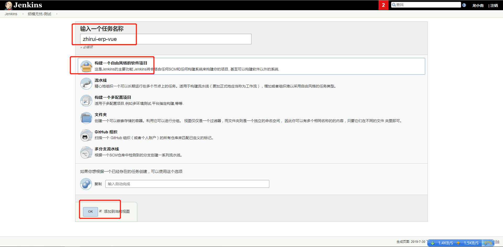
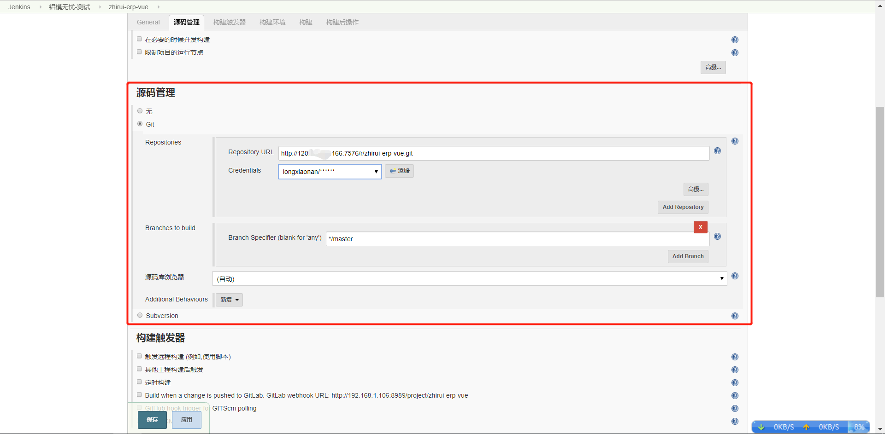
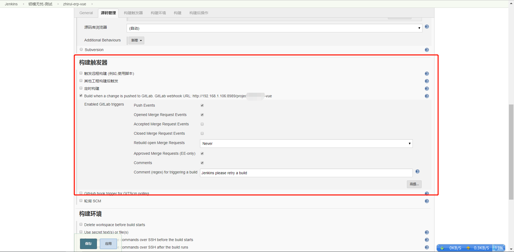
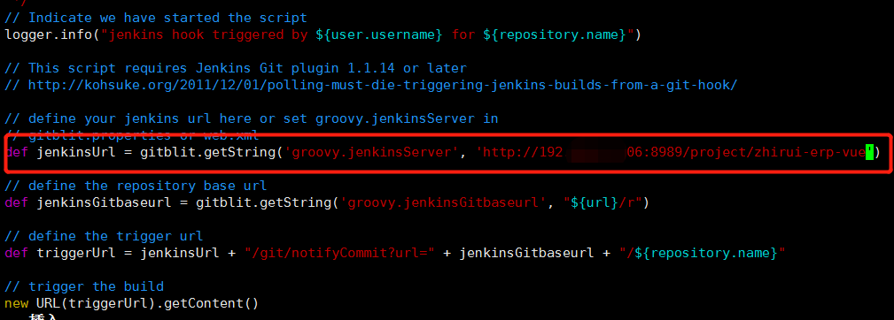
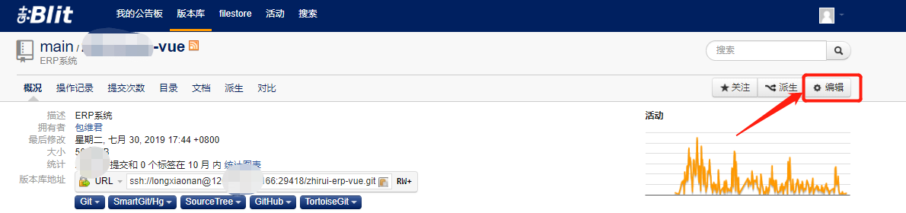
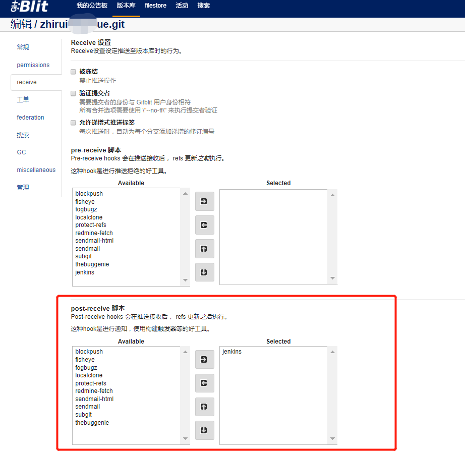
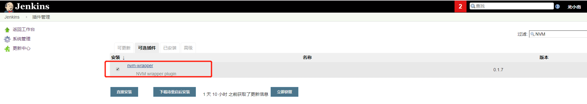
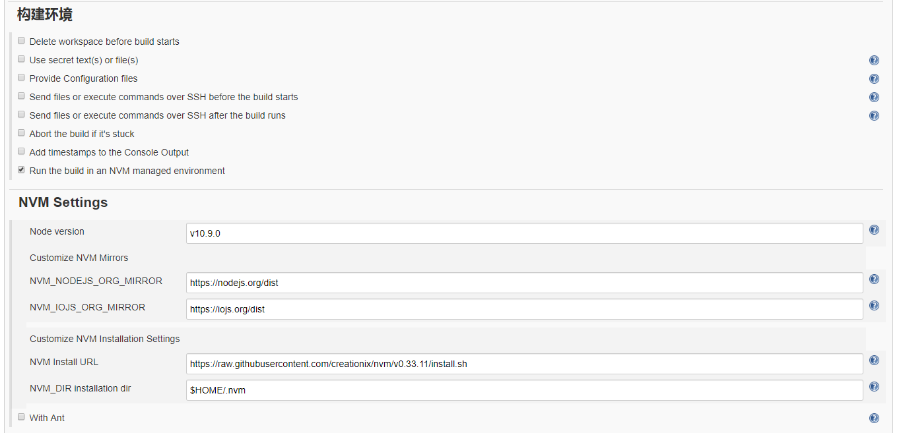

### 新建任务



### 配置 git 仓库地址



### 配置触发器

记得保存红框中 URL 后边的地址，后续会填写到 gitlab 里边。




### 配置 git 仓库钩子

#### 配置`groovy`文件

该目录下默认有个`jenkins.groovy`的文件

> 如果找不到目录，可以通过命令`find / -name  jenkins.groovy`查找出来。

```shell
[root@zhirui-server groovy]# ll
总用量 80
-rw-r--r--. 1 root root  3711 8月  21 2018 blockpush.groovy
-rw-r--r--. 1 root root  3885 8月  21 2018 fisheye.groovy
-rw-r--r--. 1 root root  6897 8月  21 2018 fogbugz.groovy
drwxr-xr-x. 2 root root     6 8月  21 2018 grape
-rw-r--r--. 1 root root  3432 8月  21 2018 jenkins.groovy
-rw-r--r--. 1 root root  4186 8月  21 2018 localclone.groovy
-rw-r--r--. 1 root root  4713 8月  21 2018 protect-refs.groovy
-rw-r--r--. 1 root root  2815 8月  21 2018 redmine-fetch.groovy
-rw-r--r--. 1 root root  6971 8月  21 2018 sendmail.groovy
-rw-r--r--. 1 root root 18022 8月  21 2018 sendmail-html.groovy
-rw-r--r--. 1 root root  5353 8月  21 2018 subgit.groovy
-rw-r--r--. 1 root root  3831 8月  21 2018 thebuggenie.groovy
[root@zhirui-server groovy]# 
```

用vim编辑该文件， 将jenkinsUrl参数配置成上面jenkins中触发器配置中生成的url。



点击编辑



将刚才的`jenkins.groovy`添加到右边。



## 配置jenkins 的构建环境

#### 安装NVM插件





> 业务需要服务器安装node
>
> Node 官网已经把 linux 下载版本更改为已编译好的版本了，我们可以直接下载解压后使用：
>
> ```
> # wget https://nodejs.org/dist/v10.9.0/node-v10.9.0-linux-x64.tar.xz    // 下载
> # tar xf  node-v10.9.0-linux-x64.tar.xz       // 解压
> # cd node-v10.9.0-linux-x64/                  // 进入解压目录
> # ./bin/node -v                               // 执行node命令 查看版本
> v10.9.0
> ```
>
> 解压文件的 bin 目录底下包含了 node、npm 等命令，我们可以使用 ln 命令来设置软连接：
>
> ```
> ln -s /usr/software/nodejs/bin/npm   /usr/local/bin/ 
> ln -s /usr/software/nodejs/bin/node   /usr/local/bin/
> ```

## 编写构建脚本

```shell
npm config set registry http://registry.npm.taobao.org/ &&
npm install&&
rm -rf dist&&
npm run build&&
```

