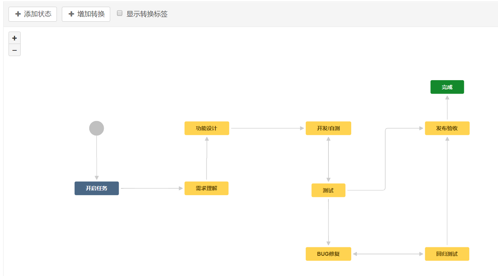

# jira安装和配置

[TOC]

## jira官网文档地址

官网地址：
https://cn.atlassian.com/software/jira/features
安装和启动方式：
https://confluence.atlassian.com/adminjiraserver072/installing-jira-applications-on-linux-from-archive-file-857048170.html

第一次启动需要设置数据库连接，需要手动配置jdbc驱动程序：
https://confluence.atlassian.com/adminjiraserver/connecting-jira-applications-to-mysql-5-7-966063305.html

## 安装和环境配置

数据库配置文件：
/data/jira/jirasoftware-hom/dbconfig.xml

数据库驱动包：

修改启动端口：
安装目录下的conf/server.xml
启动方式；
./bin/start-jira.sh
停止方式：
./bin/stop-jira.sh

## 平台介绍

https://confluence.atlassian.com/jirasoftwareserver/doing-more-with-your-agile-projects-938845146.html

## 工作流程配置参考：

## 破解：
将一个jar包复制到jira的指定目录即可，复制命令如下：
cp atlassian-extras-3.2.jar jira/atlassian-jira-software-8.2.2-standalone/atlassian-jira/WEB-INF/lib/
jar包在百度云盘中