# 软件技术方案需要的各种图

中秋为了赶项目竞标，弄一个软件技术方案，需要很多的图。画图还不太熟练，按照自己理解和临摹别的大神的图，终于能够交差了。加上以前画的图，在这里收集下，以后备用。

> 这些图大概是我一天的工作量，我是用一个叫做亿图软件的画图软件画的，这个软件很感觉不错，如果大家需要原图文件的留言啊，有部分图可能涉及到公司信息，所以我私发啊。

有兴趣去看看我的github项目啊， 求start [SpringBoot整合jwt和mybatis-plus的脚手架项目](https://github.com/longxiaonan/java-sea/blob/master/javasea-volcano/javasea-volcano.md)

## 用例图

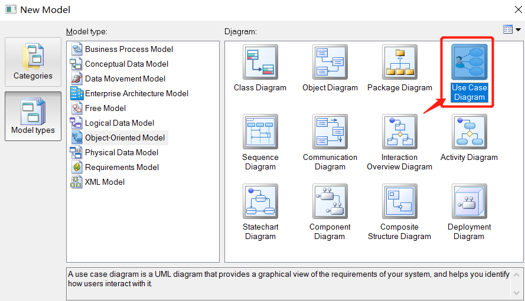

## 技术架构图

### 基于Spring Cloud的后台技术架构图1

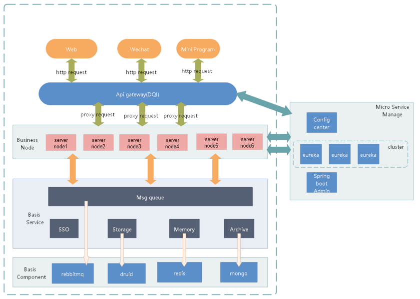

### 基于Spring Cloud的后台技术架构图2

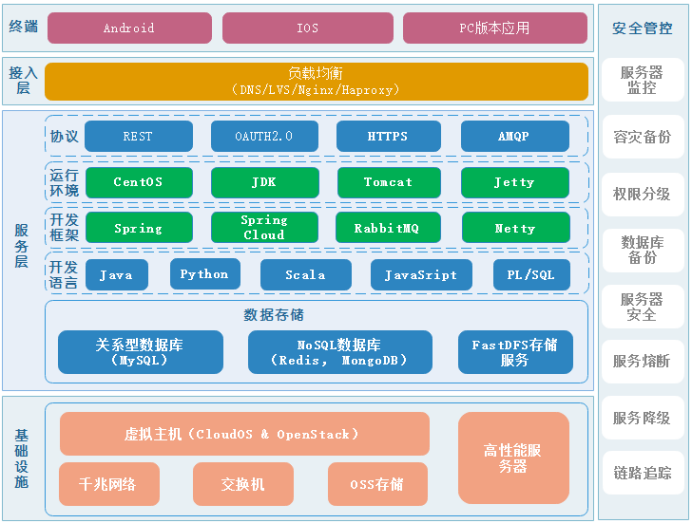

### 前端技术架构图

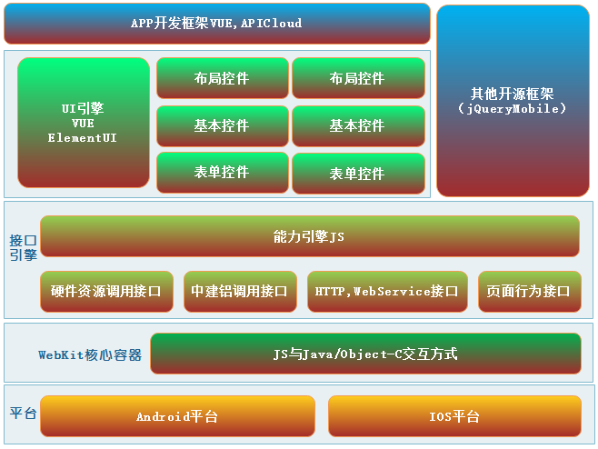

## 系统架构图

### SAAS-HRM人力资源管理系统

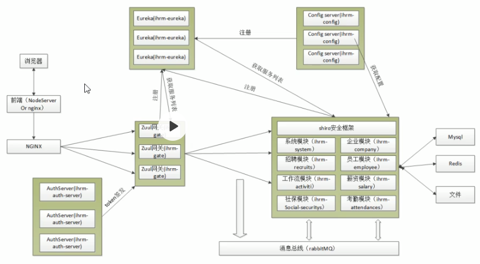

### erp系统架构图

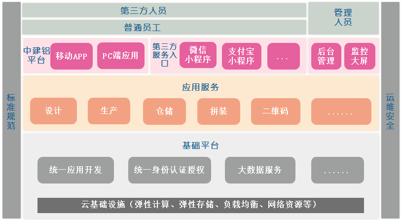

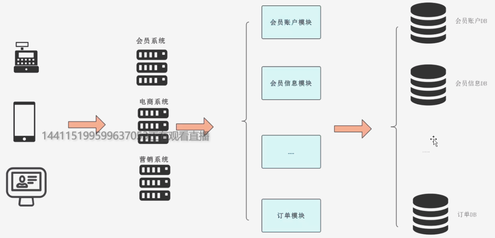

## 系统结构图

## 开发流程图

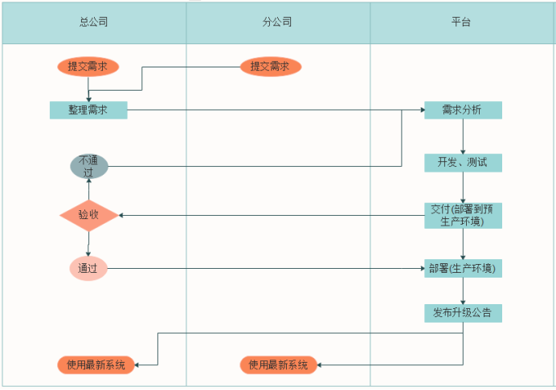

## 认证相关示意图

### 统一用户中心示意图

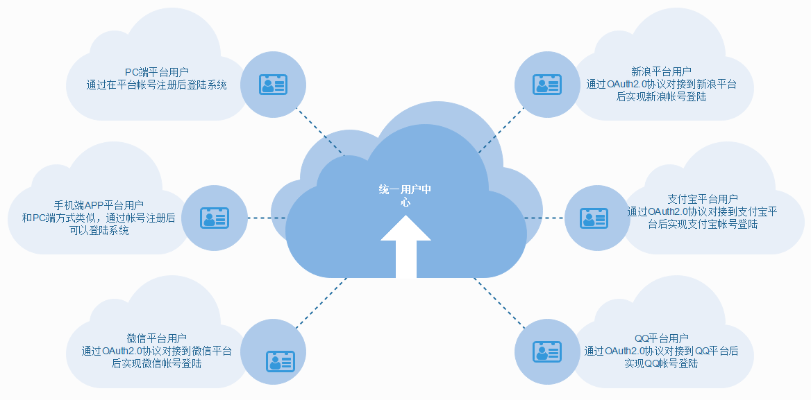

### 认证流程图

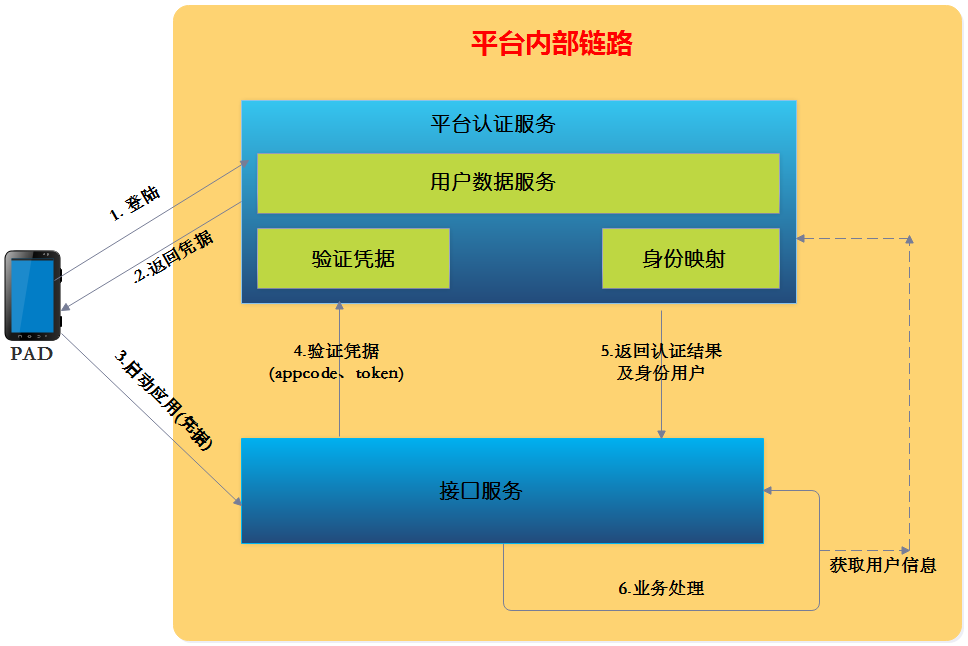

## 部署结构图

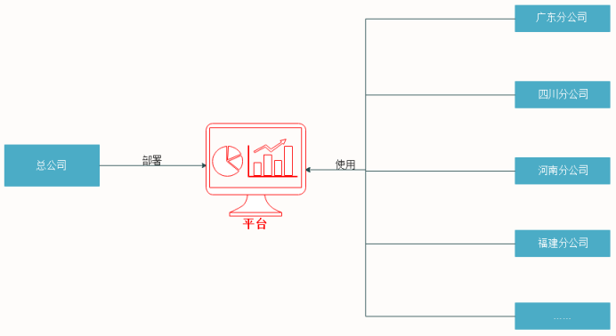

## 负载均衡架构图

软件负载均衡(LVS, nginx, Haproyx-》硬件负载均衡(F5)-》DNS负载均衡

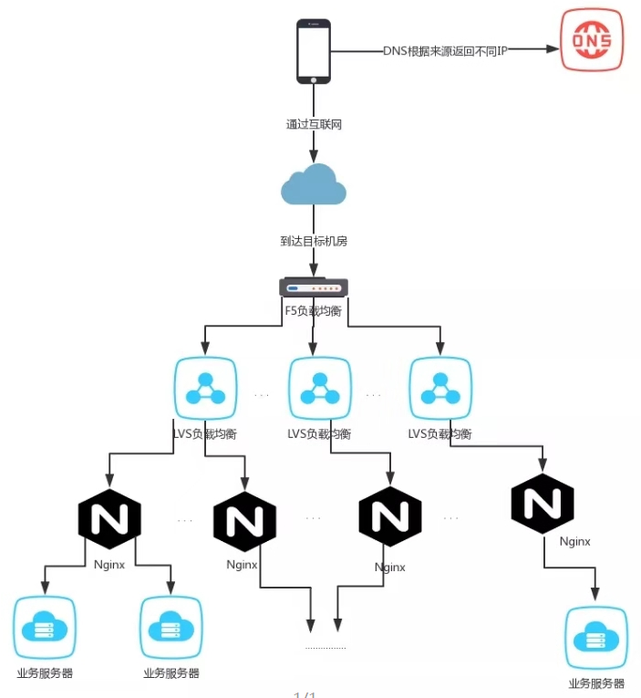

## 网络top图

### 阿里云部署网络图

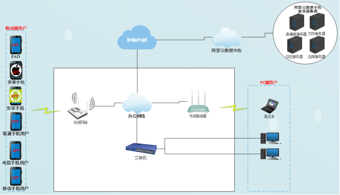

### 公司网络top图

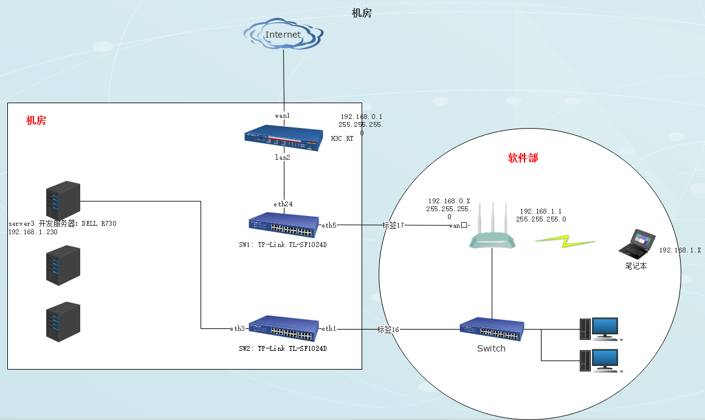

### 机柜部署图

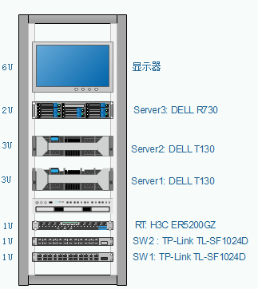

### 设备布置图

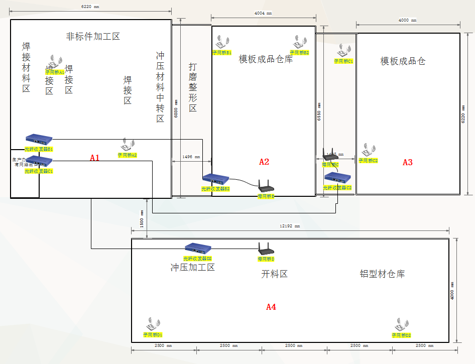

