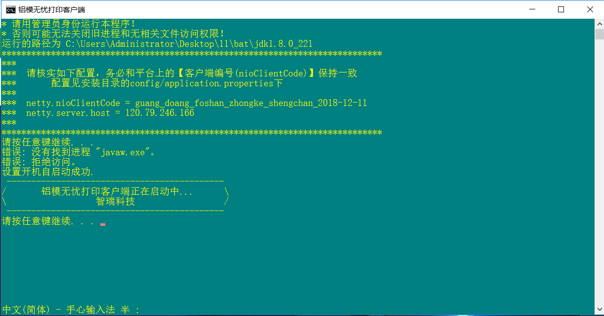

```vbscript
@echo off
::全局设置
title 铝模无忧打印客户端
color 3E
cd /d %~dp0
SET filepath=%cd%

::提示消息
echo * 本程序是用于连接打印机和铝模无忧管理平台的客户端程序！
echo * 请用管理员身份运行本程序！
echo * 否则可能无法关闭旧进程和无相关文件访问权限！

echo 运行的路径为 %filepath%
echo *****************************************************************************
echo ***                                                                       
echo ***  请核实如下配置，务必和平台上的【客户端编号(nioClientCode)】保持一致  
echo ***       配置见安装目录的config/application.properties下                 
echo ***                                                                       
::demlims如果是冒号隔开的，在echo的时候用等号显示
for /f "tokens=1,2 delims=: " %%i in (%filepath%/config/application.properties) do (
    echo ***  %%i = %%j                                         
)
echo ***
echo *****************************************************************************
pause

::删除旧进程
taskkill -f -t -im javaw.exe

::设置自启动到注册表
setlocal EnableDelayedExpansion 
reg add "HKLM\Software\Microsoft\Windows\CurrentVersion\Run" /v "lmwyclient" /t REG_SZ /d "%filepath%\lmwyclient.bat" /f %将程序写进注册表,开机自启动%
echo 设置开机自启动成功.

::运行jar
cd %filepath%\bin
start javaw -jar %filepath%\zhirui-tenant-client-0.0.1-SNAPSHOT.jar
                                                    
echo  --------------------------------------------
echo /       铝模无忧打印客户端正在启动中...      \
echo \                  智瑞科技                  /
echo  --------------------------------------------   
pause
exit
```

> 另外的一种开机自启动方式
>
> ```powershell
> ::创建快捷方式，且添加到开机自启动
> echo ThePath = "%filepath%\lmwyclient.bat">temp.vbs
> echo lnkname = "C:\Users\Administrator\AppData\Roaming\Microsoft\Windows\Start Menu\Programs\startup\lmwyclient.lnk">>temp.vbs
> echo WS = "Wscript.Shell">>temp.vbs
> echo Set Shell = CreateObject(WS)>>temp.vbs
> echo Set Link = Shell.CreateShortcut(lnkname)>>temp.vbs
> echo Link.TargetPath = ThePath>>temp.vbs
> echo Link.Save>>temp.vbs
> echo Set fso = CreateObject("Scripting.FileSystemObject")>>temp.vbs
> echo f = fso.DeleteFile(WScript.ScriptName)>>temp.vbs
> start temp.vbs
> ```

效果如下：

