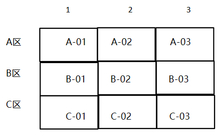
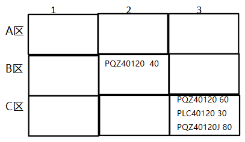
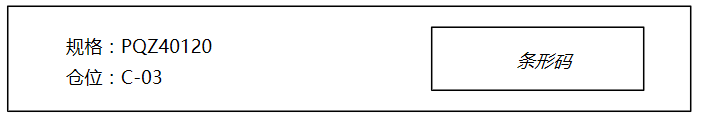

## 仓库预设

### 仓库中划分好仓位

划分仓位后的示意图如下：

仓位示意图

每种规格都放置到固定仓位下，如下图所示，在`C-03`仓位中，存在三种规格：`PQZ4012`,`PLC40120`,`PQZ40120J`。每种规格对应各自的库存数量。

> 当然也可能存在规格在指定仓位放不下的情况，所以`B-02`仓位中也存在规格`PQZ40120`的40件库存。

仓位库存示意图

### 制定`规格条形码`

每个仓位下的规格都有个条形码， 长宽为(100mm*20mm)，在仓位的指定位置上粘贴，类似超市货架，标识该位置下的铝模板规格。**条形码内容需要包含规格信息。**

> 程序设计条形码内容的时候还需要设置仓位信息，在后面扫码出入库的时候才能知道是对哪个仓位进行库存的修改。

## 入库

### 相关角色

| 职位 | 职位描述                       |
| ---- | ------------------------------ |
| 校编 | 库存盘点，表单提交等           |
| 仓管 | `校编`表单审核，出入库实际操作 |

### 思路

1. `校编`申请入库

   校编提交规格的申请清单，APP

2. `仓管`审核

   仓管收到校编`提交的申请清单，去现场清点后核实数量。WEB, APP

3. `仓管`执行入库

   在第2步中核实入库数量后，通过APP扫`规格条形码`进行入库。APP

### 步骤

#### 校编申请入库

`校编`量尺寸，确定板规格，通过app申请入库，填写的入库单如下。

* 操作

  手动添加规格，加载出仓位

  扫码添加规格，加载出仓位

  添加规格后也可以不选择仓位进行提交

| 入库单    |      |      |
| --------- | ---- | ---- |
| 规格      | 数量 | 仓位 |
| PQZ40120  | 100  | C-03 |
| PQZ40120  | 30   | B-02 |
| PQZ40110J | 50   |      |
| PQZ40150  | 200  | C-01 |
| PLC40120  | 100  |      |

#### `仓管`去现场确认和入库

* 操作

  确认：核实`校编`提交的入库数量，按照实际的填写`确认数量`，如果没填写仓位，状态变为`已确认`，如果有填写仓位则确认后进行入库，状态变为`已入库`。

  扫码入库：校编没填写仓位，那么确认后还需要入库，扫仓位下规格的条形码后进行入库。

| 入库单    |      |          |        |      |
| --------- | ---- | -------- | ------ | ---- |
| 规格      | 数量 | 确认数量 | 状态   | 仓位 |
| PQZ40120  | 100  | 105      | 已入库 | C-03 |
| PQZ40110J | 50   | 50       | 已确认 |      |
| PQZ40150  | 200  |          | 未确认 | C-01 |
| PLC40120  | 100  | 80       | 已确认 |      |

## 出库

### 相关角色

| 职位 | 职位描述                     |
| ---- | ---------------------------- |
| 校编 | 库存盘点                     |
| 仓管 | 电脑端操作，实际出入库操作等 |

### 思路

1. `仓管`导入出库清单

   `仓管`导入需要出库的清单，填写项目信息，WEB

2. `仓管`对入库清单进行库存对比，制定捡料单。WEB

3. `仓管`执行入库

   在第2步中核实入库数量后，通过APP扫`规格条形码`进行入库。APP

导入出库清单

| 入库单    |      |
| --------- | ---- |
| 规格      | 数量 |
| PQZ40120  | 100  |
| PQZ40110J | 50   |
| PQZ40150  | 200  |
| PLC40120  | 100  |

### 步骤

#### `仓管`导入出库清单

操作：

* 导入：点击`导入`按钮，填写项目信息

  | 项目 | 沙湾碧桂园   |
  | ---- | ------------ |
  | 楼栋 | 3#           |
  | 电话 | 0735-3457111 |

  

| 项目 | 沙湾碧桂园   |
| ---- | ------------ |
| 楼栋 | 3#           |
| 电话 | 0735-3457111 |

