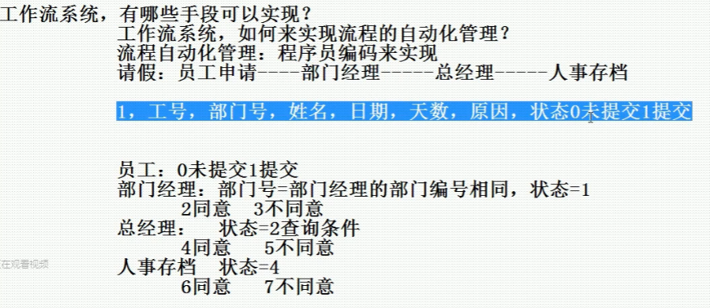

1. 编码方式进行审批流程

   

2. activity工作机制

   

3. BPM & BPMN

   BPMN2.0

4. activity7 有25张表

5. 整合到项目的具体步骤

   * 项目整合Acitviti
   * 实现业务流程建模，使用BPMN实现业务流程图
   * 部署业务流程到Activiti
   * 启动流程实例
   * 查询待办任务
   * 处理待办任务
   * 结束流程