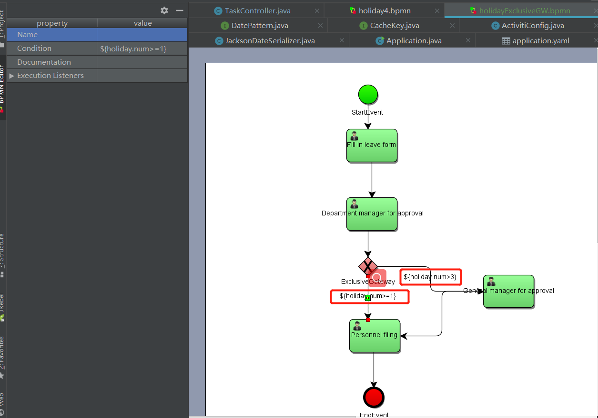
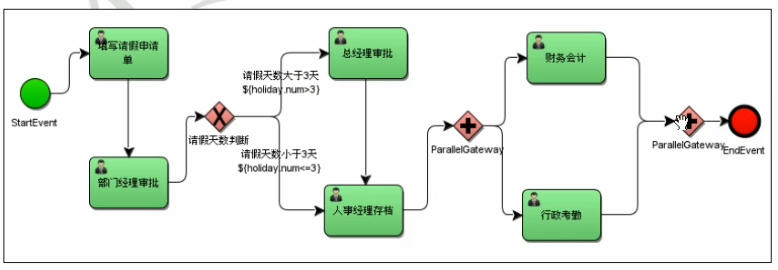
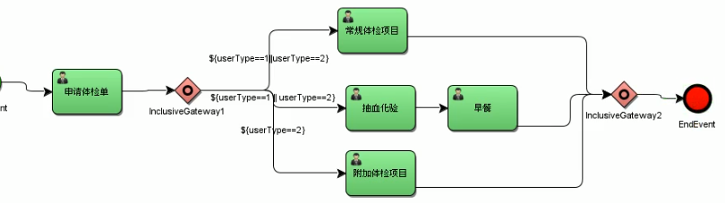

#### 排他网关：

两个条件都成立的时候，走id小的分支，如`总经理审批`的id是5，`人事存档`的id是7，所以会走`总经理审批`这个分支。

如果两个条件都不成立，那么就会抛出异常，因为`排他网关`也不知道怎么走了。

#### 并行网关：

先分支（忽略连线上的条件），再合并，需要分支都完成，那么并行网关执行完成，才能继续下个任务。

#### 包含网关：

在条件成立的情况下（排他网关），可以同时执行多个分支的任务。比如5个分支，其中3个分支条件成立（为true），那么这3个分支都可以并行。当3个分支都执行完毕，包含网关执行完成，才能继续下个任务。

