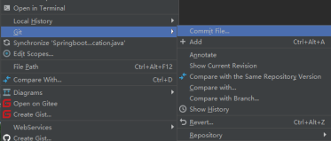
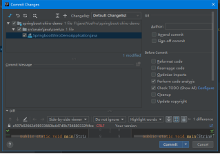
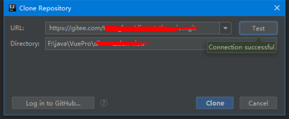

## Idea使用gitee管理项目
提前电脑已安装git，知道git.exe路径
### idea配置git
选择Git 找到git安装目录中Git/bin/git.exe ，点击Test按钮测试，看到如下结果表示idea配置Git成功，点击OK

### idea安装gitee插件

安装后重启
### 项目上传Gitee
添加gitee的用户和密码

创建一个项目后选中，点击导航栏 VCS -> Import into Version Control -> 托管项目到码云gitee

Git提交和推送Gitee操作

或者直接Commit+push

### Gitee下载项目
复制gitee仓库的https连接

VCS ->check out from version control -> Git

如果需要登录就再次登录gitee就好，Clone 一直确认就好

### 创建分支、合并、切换、删除
https://blog.csdn.net/dasini321/article/details/84427406

